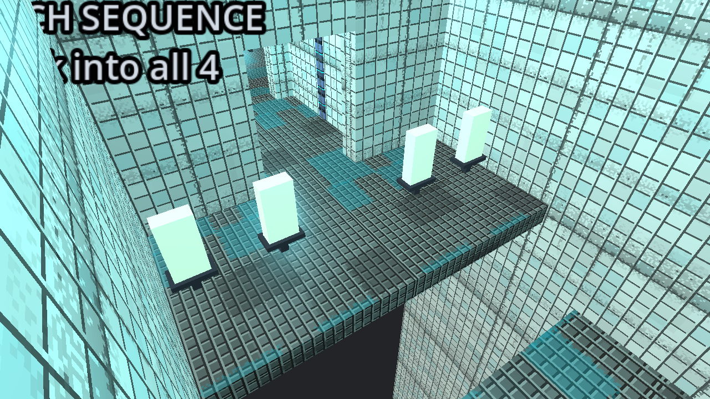

# The owner's own session, read

**Source:** the owner's uploaded bundle — the `.diagnostic-582e954`
slot JSON, its `.bak`, and one `playtime.jsonl` — worked from a
disposable copy outside the repository. **Not committed. Originals not
modified.** Checksums verified against the bundle's own `SHA256SUMS.txt`
and against the loose copies shared earlier: same bytes.

**Build played:** `582e954da8e7`, Windows, Python 3.14.4, **`tree:
dirty`** — provenance, not a diagnosis. The bundle carries no
uncommitted diff, so matching this checkout to that commit cannot prove
the historical code was identical.

---

## The fixture is that Zone, and so is its geometry

Two separate claims, and only the first was ever checked.

**The content.** The uploaded proposal at `/zones/0/zone` is
**byte-identical** to `godot/tests/fixtures/played_zone.json` as parsed
JSON, and both hash to `fe2b014761fbb449` — the `zone_digest` in the
playtime record.

**The placement, which is new.** The save also carries the *committed
manifest* at `/zones/0/manifest`, and **the fixture carries none**. So
every engine measurement this batch built the Zone by SOLVING its layout
afresh: the right rooms, but an arrangement nobody had checked against
the played one.

Checked now. `godot-traverse` builds the saved proposal twice — once
re-solved, once replaying the committed manifest — and compares every
room transform:

> **re-solving reproduces the committed placement exactly: worst room
> 0.000 m**, across all 24 room records.

So the earlier measurements were on the played geometry after all. That
is a verified result rather than the assumption it had been, and the
walker now replays the manifest regardless:

```
make godot-traverse                      # the fixture, re-solved, as before
godot --headless --path godot -- --traverse-test \
      --zone-json=<copy>/proposal.json \
      --manifest-json=<copy>/manifest.json
```

**24 of 24 checks pass on the saved level.**

---

## CHECK 126 is in c021, and CHECK 120 does not exist

**Confirmed by the game, not by a lookup.** Walking the committed
placement with the real controller, the base kit reaches the pedestal
from `c021`'s own doorway and the interact prompt reads:

> `[E] CLAIM CHECK 126`

`c021` is a procedural `platform_path`: 3 segments, declared `gap_size`
2.03, `vertical_step` 0.51, objective `platform_to_goal`, entry `USED`
and exit `SEALED`, with return plug `p:c021:start` and one four-element
untimed `switch_sequence`. The render below is that room, built from the
owner's own proposal.

**`89100120` is allocated nowhere in this save.** Checked directly
against the proposal's chambers. Any earlier "CHECK 120" wording was not
an identifier and nothing should be inferred from it.



The four switches sit **on the platform segments, spread across the
gaps** — so touching all four means crossing the course, over the drop,
with the activity timer already running. That is consistent with the 792
active seconds the record shows for `c021_0`, and it is a correlation,
not a diagnosis.

---

## The Whistle: two different Whistles, and 126 is the upgrade

The `.bak` and the live save differ in **exactly one field**:

```
slots.mobility   act_l89100076 (Fresh Rep, dash)
              -> act_l89100019 (Warp Whistle, blink)
```

Everything else — every interpretation, the proposal, the manifest, the
progress — is equal. The `.bak` is the moment before the Whistle went
into the slot. It is not a second layout, and restoring it would not
produce different geometry.

**But the final Whistle is not the Whistle that reached CHECK 126**, and
this matters for any crossing question:

| seq | from | effect | range | cooldown |
|---|---|---|---|---|
| 4 | CHECK 019 | **first acquired** | 14.0 | 2.50 |
| 5 | **CHECK 126** | range +6.0 | **20.0** | 2.50 |
| 9 | CHECK 042 | cooldown −0.2 | 20.0 | 2.30 |
| 10 | CHECK 147 | cooldown −0.2 | 20.0 | **2.10** |

CHECK 126 *is* the +6. Whatever crossing reached it was made with **at
most the 14 m Whistle**, never the 20 m one. An earlier version of this
page quoted only the final 20 m figure; that was the right number for
the wrong moment.

Fresh Rep's recorded primitive is **`dash`** — no jump-height trait is
recorded for it. An apparent assisted jump would still need controller
measurement.

**Was the Whistle needed?** Earlier I answered this from the *declared*
`gap_size` values, which is not evidence about built geometry. Answered
properly now, by walking the committed placement with the real
controller and the base kit only:

> **6 of 6 sampled Checks REACHED, 0 BLOCKED**, including
> `Reward_89100126` from `c021`'s own doorway (closest 1.20 m,
> addressable, prompt shown, real `interact()` runs). The room can be
> left again across a **2.00 m** measured gap, inside the 2.60 m
> base-kit jump.

So on the played geometry the sampled routes do not need the Whistle.
That is six sampled Checks walked, not a proof about all fifteen, and it
says nothing about how a human would choose to move.

**`Reward_89100126` sits on ground at y 1.53 with 0.00 m under it.** The
Check this lane once reported 2.6 m below the floor, and retracted, was
reached by the player and is reachable by the walker. The retraction was
right.

---

## The exit approach, on the saved join

Walked on the manifest's own `e:__exit__` (`c023` → `exit`, synthetic):

- the exit portal is **REACHED** from `c023`'s nearest doorway (10.5 m,
  closest 2.10 m) and the game's interact ray finds it;
- **3 of 16** bearings at 2.5 m around the portal are standable — that
  is placement evidence, not a route;
- `c023`'s ordinary exit is declared **SEALED** while the manifest also
  carries the synthetic exit join. **Both facts stand**; neither alone
  is a leak or an obstruction, and the route and the transition logic
  are separate subjects.

All 22 SEALED sockets on the assembled Zone measure solid, and the
deliberately mislabelled control is still caught.

---

## What the session says about the two retired families

4770 seconds of elapsed time on one Zone, 1391 of them inside an
activity. **That elapsed figure is not play time**: the owner says the
session included discussion and assistance, so it is not evidence of
difficulty or frustration and is not read as any here. 28 of 29
activities completed, 4 deaths, `zone_value` 911 against a 1000 budget.

The per-activity numbers below are a different matter — they are the
activity's own timer, and they are what the families were doing.

| family | n | completed instantly | median | max | needed a retry |
|---|---|---|---|---|---|
| `pressure_routing` | 5 | 1 | 2.72 s | 7.14 s | **2** |
| `switch_sequence` | 7 | 0 | 6.33 s | 792.65 s | 0 |
| `target_challenge` | 8 | 0 | 2.25 s | 257.82 s | 0 |
| `timed_run` | 9 | **5** | **0.00 s** | 9.14 s | 1 |

**`timed_run` was over before it started, five times out of nine.** Its
median active time is zero. A timed run whose timer never accumulates is
not a race; it is a doorway with a label on it.

**`pressure_routing` would not hold.** Of five:

| | |
|---|---|
| `c023_0` | **23 attempts** for 2.72 s of active time |
| `c011_0` | 3 attempts |
| `c015_0` | entered, 0.00 s, **never completed** — the only failure in the Zone |

Three of five misbehaved. And the room holding the 23-attempt plate ate
**1060 seconds — 17.7 minutes, a fifth of the whole session** — for 43
points of content.

**This is the strongest evidence yet for retiring those two families,
and it is not the evidence the variant is built on.** The variant
removes them to reduce content *volume*. The session says they should go
because they *do not work*: one completes itself, the other will not
latch. Those are different problems with different remedies, and cutting
the budget by 28% addresses neither.

---

## Two other things worth seeing

**`c021_0` ran its active timer for 792 seconds** on a four-element
`switch_sequence`. The render above shows why that is at least
plausible: the four switches are spread along the platform course over
the drop, so the activity is a traversal with a timer on it rather than
four switches in a room. Still a correlation — the record cannot
separate a defect from a player taking their time, or from the session's
discussion.

**The three longest rooms after the arena are all `platform_path`.** Per
the caveat above, the room timers include whatever else the session
contained, so this is a place to look rather than a measurement of
traversal cost.

---

## What this does not settle

- **Why** `timed_run` completes at 0.00 s, and **why** the `c023` plate
  needed 23 attempts. Both are reproducible-looking, neither is
  diagnosed, and neither was chased here — that would be new work.
- Whether the 792 s in `c021` is a defect, a course that simply takes
  that long, or time the session spent not playing. The record cannot
  separate them.
- **Whether the sampled six generalise.** Six of fifteen Checks were
  walked. The other nine are unwalked, not proven unreachable.
- **The `c023` exit seam.** SEALED ordinary exit plus a synthetic join
  is preserved as two facts; which one the production reconstruction
  path follows was not traced.
- Anything about the variant's router blocker, which is unrelated and
  documented in `docs/FOLLOWUP_02_INTEGRATION.md` §6a.
