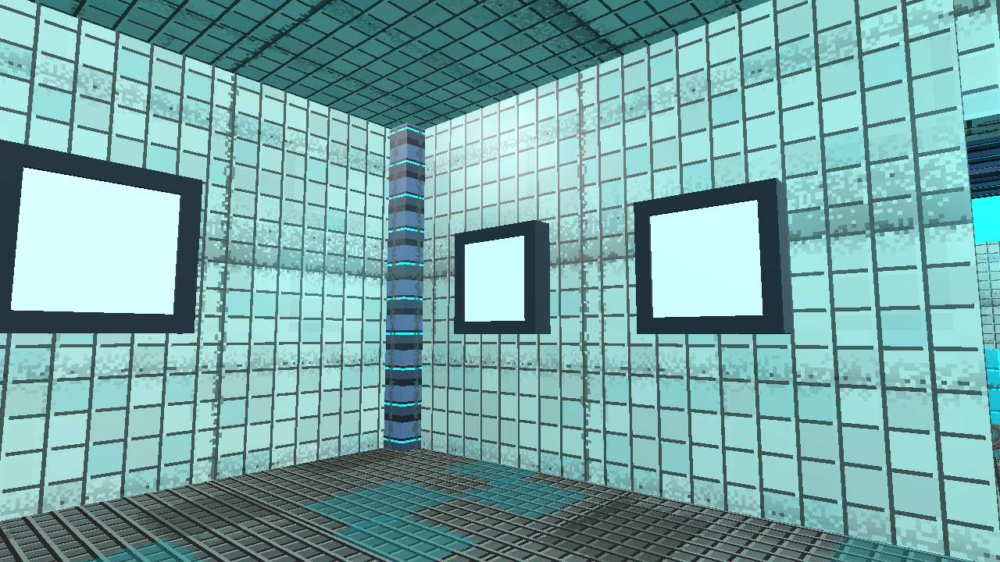
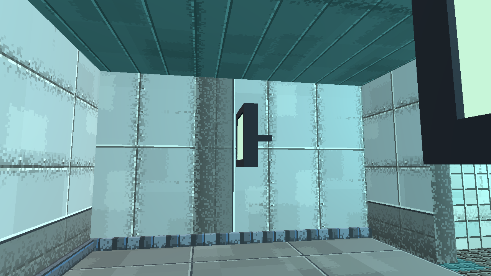
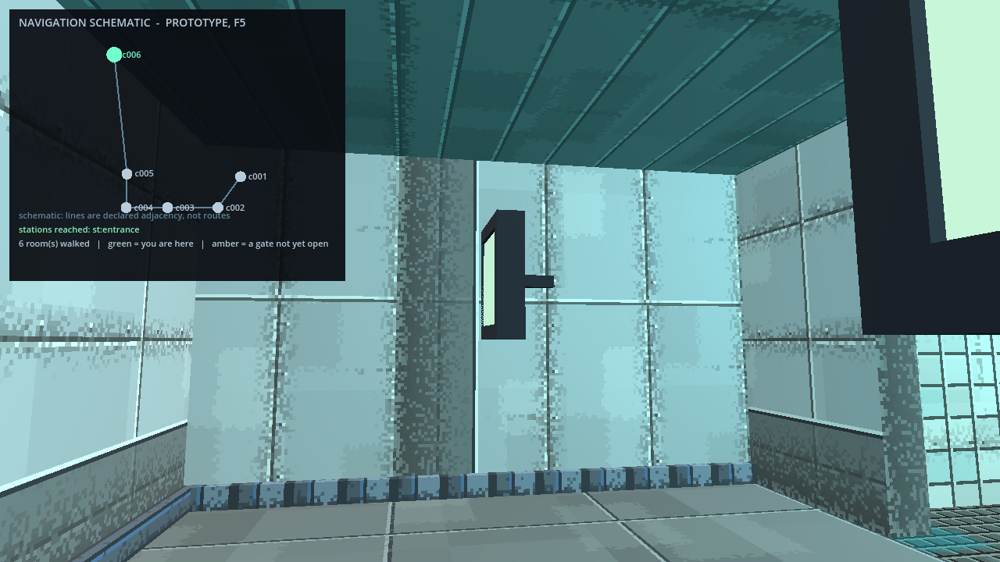

# A short review route

**Arty is the art lane; this is the engine lane's.** One pass through
the things that changed, in the order you meet them. It needs one Zone,
not a cleared campaign, and it adds no review hub: everything below is
in the ordinary first Zone of the diagnostic campaign.

Roughly ten minutes if nothing is wrong.

---

## Launch

Double-click **`Diagnostic Campaign (Windows).bat`**.

It resumes the same slot every time and never resets anything. Press
**MOCK CAMPAIGN**, take the portal into **Zone 1** ("Relay 001").

The Zone is deterministic — mock AP, the fallback Epsilon, default
scale — so the room ids below are the rooms you will actually be in.
If you want a clean run instead, drop `--new` on the command line;
your existing slot is untouched either way.

---

## 1. The station menu — right at the entrance, before anything else

You arrive standing in the **entrance station**. Press **E** on it.

- A panel opens. **It does not warp you.** That is the change: E used
  to teleport you to whichever reached station came next in build
  order.
- It lists **ENTRANCE (you are here)**, greyed and unselectable, and
  **RETURN TO HUB**. No other station is offered yet, because you have
  not reached one.
- Press **Esc**. Nothing moves.

Come back to this after step 3, once you have reached a second station,
and the panel will offer it as a destination. Select it: you should
warp once.

**Return to Hub** is the pause menu's own operation — it leaves the
Zone where it is and the Hub portal offers it back. Worth trying once,
then re-entering, to confirm you land back in the same Zone.

> There is no Save button, and that is deliberate. Reaching a station
> already writes the campaign to disk; there is no second operation to
> put behind a button. The panel says so.

---

## 2. c002 — the first arena. Targets, keys, and a deck

Two rooms in. This is the room with the ramp to the second floor you
liked.

**Targets.** The `target_challenge` here is **mounted**: the targets sit
flat against the side walls with their stalks into the plaster, at
roughly head height. Shoot one from where you are standing in the room
— you should not have to stand underneath it.

**Stairs.** Walk up onto the deck and **walk back down**. The question
is whether the way down feels like walking or like a series of small
falls. Then find a real ledge and walk off it — that must still be a
fall.

**Keys.** The **red** and **gold** keys are in this room. Pick one up
and read the card. It should be **one** message naming what it opened
— and for these two it will say *"opened 1 door elsewhere in this
Zone"*, because their locks are in rooms you have not reached. That
wording is correct rather than vague: naming a room you have not walked
would hand you the shape of a route you have not found.

Their locks are in **c011** (red) and **c014** (gold). Pick up **blue**
in c003 and **green** in c004; when you later open one from a room you
have already been in, the card names the room by what it is — "the
arena (c014)" — rather than by its id alone.

---

## 3. c007 — a small corridor. The limitation, on purpose

Its one `target_challenge` target is **not mounted**: it hangs in the
air on its stalk, the way every target used to.

That is the offer being declined, not a regression. Mounting needs a
real wall behind the stalk and somewhere a body can stand and shoot it
from; where a room cannot give both, the older placement stands rather
than a target being invented onto a wall that is not there. **15 of the
Zone's 27 targets mount; the other 12 look like this.**

The rooms that decline: **c002** and **c006** (some of their targets),
and **c007** and **c022** — 6.8 m corridors where the only wall stretch
left after the doorway clearances is the doorway itself.

Worth your eye: is the unmounted look acceptable as a fallback, or does
it want a floor stand? **That is an art and design call, not one this
batch made.**

**c006, the big Hall**, is on the way and now mounts most of its
targets — worth a look for the contrast, and it has a station in it.
Reaching that station is what gives the panel in step 1 something to
travel to.

---

## 4. F5 — the navigation schematic

Press **F5** anywhere in the Zone.

**Diagnostic overlay, not a game feature.** It sits beside the F3
readout and the F4 labels, it is off by default, and nothing in the
game reads it. It shows only rooms you have actually walked and only
links between two of them; it does not survive a reload; there is no
bearing arrow and no path guidance.

The question for you is whether this is *the* map or a sketch of one.

---

## Diagnostic positioning, kept separate

Nothing above asks you to teleport, spawn or reposition anything. The
only diagnostic aids are the **F5 overlay** and the **F3/F4** ones that
were already there. Every observation is made walking.

Where the automated evidence used diagnostic positioning — placing a
body at a doorway to walk one route, or composing a probe room — that
is recorded as such in the suites and is never presented as a walked
campaign.

---

## What this route cannot tell you

- **Whether any of it is fun.** Screenshots are presentation evidence.
- **Windows.** The `.bat` files have never been executed here; this
  container has no `cmd.exe`. Their logic lives in Python where it is
  tested, but the double-click itself is unproven.
- **Your own Zone.** This is the repository's deterministic fixture. The
  Whistle crossing and the original exit seam still wait on a private
  copy of your diagnostic save.
