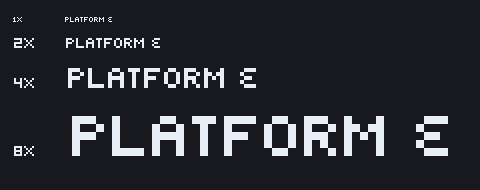

# `ui_text` gains ε for "PLATFORM ε"

*Arty — 2026-09-28*

**One character, and only this one, for Production's sign.** The line is
`"PLATFORM ε"` in `godot/scripts/generation/chamber_builders.gd:1137`,
read at `c12a72f`. Its ε is U+03B5, GREEK SMALL LETTER EPSILON. The face
is not being expanded, and the menu is unchanged.

Every pixel above, the scale labels included, is drawn by `ui_text`
alone, through Godot's own importer, with every fallback switched off.

## The commit Production would take

| | |
|---|---|
| **Commit** | `94f6e82a170c4edf7ef9ba55e899fffb06e7db10`, alone |
| **Source** | `tools/glyphui/author_text.py`: one `GLYPHS` entry |
| **Generated** (a pair; take both) | `assets/ui/ui_text.fnt` (74 → 75 characters) and `assets/ui/ui_text.png` (the same 126 × 40 page) |
| **Depends on** | Nothing else: no code, no import setting, no other asset. The Glyph CLI is needed only to regenerate the face, not to use it. |
| **Applies to** | It cherry-picks cleanly alone onto `a1584c8`, where the pipeline rebuilds it byte-identical. It also cherry-picks cleanly onto Production's `12a8ede1`. It does not include the candidate model repairs. |

**Why the two files are a pair.** Frames are in code-point order, so the
15 characters after U+03B5 each move one slot on the page, and the `.fnt`
records their new positions. A new `.fnt` with the old page, or the
reverse, would draw the wrong glyphs.

**Production's shipped copy** is `godot/content/ui/ui_text.{fnt,png}` (at
`12a8ede1`), with its `.import` files. It is byte-identical to this face
before the change, so taking ε means replacing those two files with the
new pair. That is Production's step. I did not edit that copy, that
branch or that session. The page size is unchanged, so the existing
import settings still apply.

**How the sign reaches it.** At `12a8ede1` the sign is a `Label3D`
whose text is the string as written, with no upper-casing. So the
lowercase U+03B5 is the character it asks for. (The menu kit's
`display()` upper-cases, which would turn ε into Ε, U+0395, but the menu
shows no ε.) The label sets `font_size` 34 and no font. Which face the
sign uses, and at what size, is Production's binding. The face is proved
at 8, 16, 32 and 64 px.

## The glyph

    .###
    #...
    .##.
    #...
    .###

- It uses the face's own 7 × 8 cell, rests on the same baseline
  (`base=6`), and starts its ink at x = 1. Its advance is 5, like `C`,
  `E` and `S`.
- **It is full height.** At the 3-row x-height of `x`, an epsilon has no
  room for its two bowls and pinched waist, and it read as a `c`.
- **It is built from the face's own parts:** the `C`'s rounded top and
  bottom, and the `S`'s `.##.` waist. Open on the right, with rounded
  corners, it cannot be taken for `E` (square, full middle bar) or `3`
  (open on the left).

## Verified

| Check | Result |
|---|---|
| `author_text.py` (the Glyph pipeline) | 75 characters; `check_font`: no faults across 75 glyphs. A second build is byte-identical. |
| `python3 tools/glyphui/verify_face_unchanged.py 94f6e82a~1` | PASS. All 74 existing characters have the same pixels, size, offsets and advance. 59 kept their slot; 15 moved one slot on the page. |
| `tools/content/run_font_import.sh` (the editor's BMFont importer and the runtime parse) | PASS. `ui_text`: 74 inked advances compose as declared and stop where the ink stops (73 before; the space has no ink). |
| `tools/glyphui/run_platform_proof.sh` | PASS. `ui_text` has 0 fallbacks and system fallback off, and has every character of the line. The drawn ε matches the authored rows pixel for pixel at 1x and at 2x. |

The proof tools are in the commit after the glyph, not in it. Each claims
`godot/_harness` or stops: none clears a folder it did not create.

**Holding** for the remaining visual decisions.
