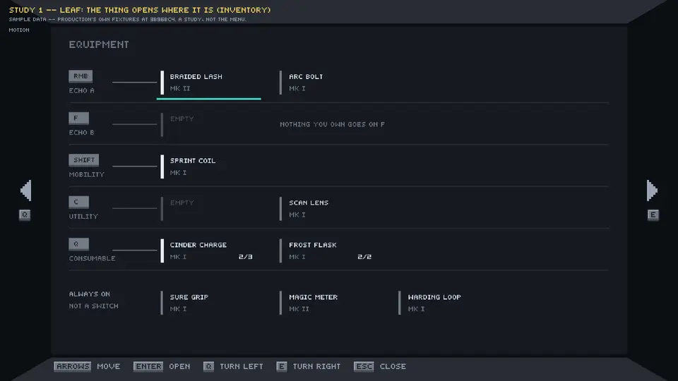
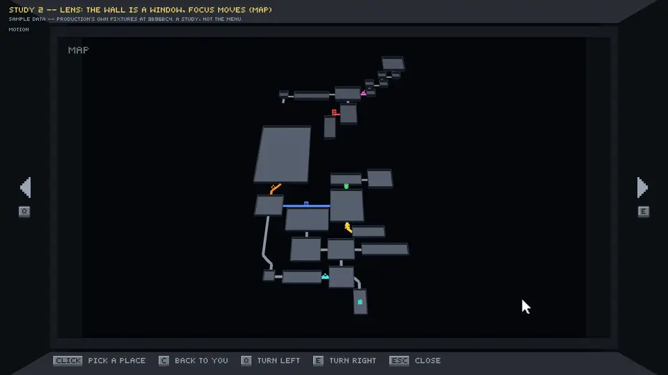
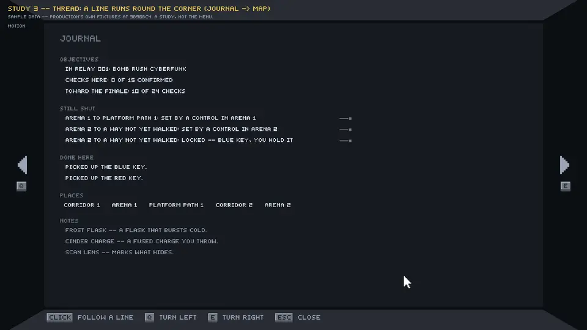

# Track A2 — three ways the menu can move

*Arty*

**CANDIDATES, for your selection. Nothing here is approved, and nothing
in Production changed.** These are three low-detail spatial-interaction
studies. Each one is captured in motion and in reduced motion, from a
small isolated art-lane prototype (`tools/menu_studies/`). They are
review scenes, not the menu: they have no input map, no data binding and
no save.

**Evidence scope.** Scripted input over Production's own sample data,
rendered in Godot 4.5.1 at 1920 × 1080, with Production's box at
Production's numbers. The prototype plays a timeline and takes no input.
This is NOT Production's runtime and NOT integrated gameplay. Nobody
has played it by hand with a mouse or a pad.

| | Face | The idea in one line | Watch |
| --- | --- | --- | --- |
| **1 · LEAF** | Inventory | The thing opens where it is, and each row is a key. | [`leaf/motion.mp4`](leaf/motion.mp4) |
| **2 · LENS** | Map | The wall is a window. Focus moves; the rooms never do. | [`lens/motion.mp4`](lens/motion.mp4) |
| **3 · THREAD** | Journal → Map | A line on one wall points round the corner at its place on the next. | [`thread/motion.mp4`](thread/motion.mp4) |

Each capture is about 9 seconds long and shows the same five moments:
1. rest;
2. select, and see useful information;
3. change the selection;
4. turn to the adjacent face;
5. return.

Each study's folder holds:

| File | What it is |
| --- | --- |
| `motion.mp4` | The capture, every frame, 30 fps, 1920 × 1080. The text is at the size the game draws it. |
| `reduced.mp4` | The same steps with reduced motion: every travel is a cut. |
| `preview.webp` | The motion capture at half size, to watch inline. The text is **not** at gameplay size here. |
| `stills/` | Each settled moment, full size. |
| `settled.png` | Each settled moment, MOTION beside REDUCED MOTION. |
| `filmstrip.png` | What moves: the first 0.6 s after each step. |
| `differs/` | Only where the two runs' settled frames differ: *where*, in red over the motion frame. |
| `captures.json` | Frame counts and marks, and how far the two runs' settled frames differ. |

Everything in these folders is generated by
`tools/menu_studies/run_menu_studies.sh` and must not be edited.

---

## What all three keep

* **Production's box, as built at `3b96bc4`.** Four inward walls at
  DISTANCE 1.0, FOV 60 and FILL 0.86. Each page is 1280 × 720. A turn
  is `MenuShell`'s 0.42 s cubic in-out, and with reduced motion it is
  a cut. Turning LEFT goes Settings/Pause → Equipment (Inventory) → Map
  → Journal (Objectives/Lore) → Settings, with Q/LB to the left and
  E/RB to the right.
* **The real semantics.** Every word on a wall is Production's own
  answer, from `EquipmentQuery`, `MapFace` or `JournalQuery`, on
  Production's own fixtures (see *Sample data* below). The keys are
  Production's five `SLOT_NAMES` with their bindings from
  `project.godot`. The map is `ZoneController`'s committed rooms and
  connectors.
* **Production's ownership.** Runtime, input, data binding and saves
  are Production's. The prototype draws the result of a scripted
  choice, and an "equip" goes nowhere.
* **The Glyph kit.** Text is `ui_text` / `ui_numerals` at an integer
  scale, 2× on the walls, so one page pixel is about 1.29 screen
  pixels at 1080p. The prompts use the keycap nine-slice, the turn
  cues use the page arrows, and the map marks use the symbols
  `blocked`, `circuit` and `control`. The only new pieces are the ones
  a study's interaction needs, all in flat colour. The studies are
  meant to be compared as interactions, not as finish.
* **Interruptible, and never a cinematic.** Every change animates from
  wherever things are *now*: a new input retargets mid-flight rather
  than queueing. The longest settle in any study is 0.6 s (Thread's
  rewind plus recast). Nothing waits for anything to finish.
* **Reduced motion keeps the same information and actions.** The
  reduced-motion run takes the identical steps at the identical times,
  and every travel is a cut. `settled.png` puts the two runs side by
  side, and `captures.json` measures the difference (see *Reduced
  motion, measured*).

---

## 1 · LEAF — the thing opens where it is (Inventory)



**The idea.** A picked item is not described somewhere else. It unfolds
in place, and what was folded inside it is its detail:
* A header leaf swings out of its right edge, and a body leaf folds out
  under it. It folds down, or up when the row sits low, always toward
  the free wall.
* The item's neighbours on the row step aside.
* The rows it hangs over drop back in value behind it.
* Move away, and it folds up again.

**The layout is the data's own: each row is a key.** Production's five
keys start the rows, each with its real binding: RMB, F, SHIFT, C and
Q.
* The item on a key sits in the socket beside it. What else could go on
  that key follows along the row.
* So "what is on RMB, and what else could be" is one glance, and the
  comparison in the detail (now → this) is with the leaf in the same
  row.
* ECHO B has no candidate in the sample and says so ("NOTHING YOU OWN
  GOES ON F").
* ALWAYS ON is a row without a key, because a passive is not a switch.
* The four Gear territories exist in the contract but can hold nothing
  yet, so they are not drawn.

| | Moment | Still |
| --- | --- | --- |
| 1 | **Rest.** Each row is a key; what is on it sits in its socket. | [`01_rest`](leaf/stills/01_rest.png) |
| 2 | **Select.** Arc Bolt opens where it is. Its detail says what it does, how you use it, what it costs, and how it compares with Braided Lash, the leaf on RMB. It ends with ENTER · PUT ON RMB. | [`02_select`](leaf/stills/02_select.png) |
| 3 | **Change.** Moving away folded it. Frost Flask opens UP, toward the free wall, and compares with Cinder Charge on Q. | [`03_change`](leaf/stills/03_change.png) |
| 4 | **Adjacent.** A turn left: the map, at rest. | [`04_adjacent`](leaf/stills/04_adjacent.png) |
| 5 | **Return.** Frost Flask is still open, and the focus is still on it. | [`05_return`](leaf/stills/05_return.png) |

**Input in the capture:** keyboard or pad.
* Focus is a signal bar that slides under the leaf. The leaf's spine
  turns signal and its ground comes up.
* ENTER opens; moving away folds; Q and E turn.

**What it costs.**
* The open leaf covers the rows it hangs over. They stay visible behind
  it, dimmed.
* With a mouse, the neighbours that step aside would move out from
  under the pointer. The mouse version should open on click only and
  leave the row where it is, or the pointer rule is broken. The capture
  does not show a mouse.

---

## 2 · LENS — the wall is a window, and focus moves (Map)



**The idea.** The map is neither a picture on the wall nor a viewport
boxed in by panels.
* The wall opens, and the Zone's miniature stands in the space behind
  it, filling the face.
* Picking a place moves the lens. The miniature glides and closes in as
  one rigid thing, so no room ever moves relative to another.
* Everything the pick is not about drops back in value.
* What is known about the place unfolds on a card tethered to it, not
  in a column at the side.
* Picking a neighbour carries the lens across. The passage between the
  two places lights along its real path, and if it is shut, its gate
  and its reason light with it.

**The map stays the main content.** At rest the whole Zone fills the
window. The only panel is the card, and it exists only while a place is
picked.

| | Moment | Still |
| --- | --- | --- |
| 1 | **Rest.** The wall opens onto the whole Zone, and you are the signal pin. | [`01_rest`](lens/stills/01_rest.png) |
| 2 | **Select (mouse).** The lens closes around Arena 1, which stays under the pointer. The card is `MapFace`'s own detail: each way out, with its state, and its reason when it is shut. | [`02_select`](lens/stills/02_select.png) |
| 3 | **Change (pad, D-pad right).** The lens is carried to Platform Path 1 across the shut span, and the span lights along its path. | [`03_change`](lens/stills/03_change.png) |
| 4 | **Adjacent.** A turn left (LB): the journal, at rest. | [`04_adjacent`](lens/stills/04_adjacent.png) |
| 5 | **Return.** The lens is where you left it. | [`05_return`](lens/stills/05_return.png) |

**Input in the capture:** the mouse, then the pad.
* **The mouse picks.** The pointer travels and the click picks. The zoom
  closes around the point under the pointer, so the room you clicked
  never slides away from it.
* **Then the pad takes over.** D-pad right is `MapFace.step_place`, and
  the pointer hides. The picked room is carried to a fixed focus point,
  the turn keys at the edges become LB and RB, and the prompts follow
  the device.

**Truthful by construction.**
* Rooms are their committed rectangles at their standing heights, and
  connectors are their built chains.
* Gate colours are Production's provisional circuit colours, and the
  pulse is its 1.2 Hz.
* The only presentation transform is the whole miniature at once.

**What it costs.**
* It is the heaviest of the three to build: a lit 3D miniature inside
  the page.
* The tilt (55°) foreshortens the far rooms. The Zone's top edge reads
  smaller than its bottom, which is true to a view but not to a plan.
* The card can cover a neighbour of the picked room. It is placed
  beside the room, and it is held inside the window.

---

## 3 · THREAD — a line runs round the corner (Journal → Map)



**The idea.** The four walls are one room, so a thing on one wall can
point at a thing on the next.
* At rest, every journal line that names a passage shows a faint loose
  end.
* Pick one, and a thread leaves the line, runs along the wall and turns
  the corner. It carries the passage's own map mark, in its own
  colour, like a bead. That bead is what you will look for on the map.
* Turn (E), and the thread lands on that passage, with the line's own
  words waiting by the ring.
* Turn back (Q), and it leads you home to the line, still picked.
* Picking another line rewinds the thread and recasts it.

The turn stops being a page change and becomes part of reading.

**Only real links.** A still-shut line and the connector it names are
the same record.
* `JournalQuery.still_shut` walks the save's `zone_map` connectors and
  writes one line for each one that is not open, in that order. So line
  *n* is the *n*-th shut connector.
* The map it lands on is drawn from the journal's own save, the same
  `zone_map`, so the thread cannot point at a state the journal does
  not describe.

**It is not a route.**
* Over the plan, the thread is a straight leader in ink, lifted above
  the rooms.
* It runs on a casing in the wall's own colour, which cuts a clean gap
  through anything it crosses.
* No connector is ever straight, in ink, or above the rooms.

| | Moment | Still |
| --- | --- | --- |
| 1 | **Rest.** The journal: what is shut, what was done, and where you have been. The three shut ways show loose ends. | [`01_rest`](thread/stills/01_rest.png) |
| 2 | **Select.** A shut way: its thread runs to the corner, carrying the mark to look for (the span-alignment circuit). | [`02_select`](thread/stills/02_select.png) |
| 3 | **Change.** Another line: the thread rewinds and recasts, now carrying the blue lock. | [`03_change`](thread/stills/03_change.png) |
| 4 | **Adjacent.** E, a turn right: the thread lands on the blue-locked passage, with its words beside it. | [`04_adjacent`](thread/stills/04_adjacent.png) |
| 5 | **Return.** Q: the thread leads home to the line, still picked. | [`05_return`](thread/stills/05_return.png) |

**Input in the capture:** the mouse picks lines, and E and Q turn.
Nothing on the journal wall moves under the pointer: the thread is
drawn in the empty half of the wall.

**What it costs.**
* On the journal wall, a pick says only *where* (the bead, and the
  corner). The full answer is one turn away. That is the idea, and it
  is also its price.
* It needs the neighbouring wall to be the right one. Journal → Map is
  adjacent; a link to a face two turns away would have to run round two
  corners.
* It is a behaviour between faces, not a layout for one. On its own it
  leaves the Journal and Map faces' own compositions open.

---

## Side by side, as interaction ideas

| | LEAF | LENS | THREAD |
| --- | --- | --- | --- |
| Where the detail appears | In place: the item unfolds | On a card tethered to the place | On the next wall, where the thread lands |
| What moves | The leaf, its row's neighbours; the rows behind dim | The whole miniature, rigidly; the rest dims | A thread and, when you turn, the eye |
| What never moves | The key column and every other row | Any room relative to another | Anything on either wall |
| Built from | The data's own shape: keys × candidates | Production's own 3D rooms and chains | Production's own record linking the two faces |
| Shown with | Keyboard / pad | Mouse, then pad | Mouse, and E / Q |
| Settles in | ≤ 0.28 s | ≤ 0.5 s (card unfolds last) | ≤ 0.6 s (rewind + cast) |
| Its risk | Covers the rows it hangs over; a mouse needs a stiller variant | Heaviest to build; tilt foreshortens | The pick says *where*, not *what*, until you turn |

They are not exclusive. LEAF and LENS are each a way to compose one
face, and THREAD is a way for faces to refer to one another. Two
readings of your choice are possible:
* one idea as the principle for every face;
* one idea per face, with THREAD as the link between them.

That is your call; this package only asks which idea, or ideas, to take
further.

---

## Usability, against your list

| Rule | LEAF | LENS | THREAD |
| --- | --- | --- | --- |
| Text readable at gameplay size | 2× Glyph on the wall; the MP4s and stills are 1:1 | Same. The card is flat on the wall plane, not tilted with the map | Same |
| Mouse and controller focus clear | Focus bar plus spine plus ground (keys / pad) | Pointer; then a carried focus, with the pointer hidden (pad) | Picked line: ground plus signal bar; the thread |
| Resting controls don't drift from the pointer | Keyboard / pad shown. **A mouse variant must not slide the row** | The zoom closes around the pointer | Nothing moves on the wall |
| Transitions interruptible | Yes: every track retargets from where it is | Yes | Yes: a new pick rewinds from the current length |
| Reduced motion, same information and actions | Same steps, cut | Same steps, cut. The gate pulse holds still | Same steps, cut |
| No cinematic every time | ≤ 0.28 s | ≤ 0.5 s | ≤ 0.6 s, and a turn is Production's 0.42 s |

### Reduced motion, measured

Each study's `captures.json` compares every settled frame of the motion
run with the same frame of the reduced run, below the harness's caption
band:

| Study | rest | select | change | adjacent | return |
| --- | --- | --- | --- | --- | --- |
| **LEAF** | identical | identical | identical | identical | identical |
| **LENS** | 0.024 / 0.017% | identical | 0.163 / 0.112% | identical | 0.068 / 0.047% |
| **THREAD** | identical | identical | identical | identical | identical |

Each cell reads *mean absolute difference (0–255) / share of pixels
more than 8 levels apart*. "Identical" means not one pixel differs.

**LEAF and THREAD are identical at every moment.** **LENS differs only
at its gate marks**, and `lens/differs/` shows them in red. The motion
run's gates pulse at Production's 1.2 Hz, and reduced motion holds them
still at the same size and emphasis. That is the one difference the
study intends. Nothing else differs: no room, no card, no text.

---

## Found on the way

**The equipment vocabulary is NOT missing.** This was re-checked at
`3b96bc4`, and the blocker is not carried forward.
* The five keys (`SLOT_NAMES`: echo_a, echo_b, mobility, utility,
  consumable) and the four Gear territories (HEAD, TORSO, ARMS, LEGS)
  are in the contract.
* What does not exist yet is a Gear piece: `SUPPORTED_GEAR_DOMAINS` is
  empty. So the territories are real and can hold nothing, and no study
  draws them.

**Glyph gaps, found by Production's own strings.** The studies show
stand-ins for these, and they are listed here, not fixed:
* **Missing characters.** `ui_text` has no `;` `—` `→` `[` `]`.
  * Production's comparison lines use `→` and `—`; the stand-ins are
    `>` and `-`.
  * Its sentences use `;`; the stand-in is `,`.
  * `[` and `]` are `MapFace`'s own keys for the next and previous
    place, and a keycap cannot show them. The Lens capture uses the pad
    for that step for this reason.
* **No device symbols.** Mouse buttons and pad buttons are spelled out
  in the keycaps (CLICK, RMB, DPAD, LB, RB, START).
* **Circuit symbols are mapped provisionally.** Production's letters K,
  P and M are shown as `blocked`, `circuit` and `control` until the
  circuit family is drawn.
* **The signal colour has a near twin.** Production's provisional
  `state:span_alignment` circuit colour, #4de6f2, is ΔE2000 10.1 from
  signal (#39d7c8). The next closest circuit colour, `key:green`, is
  21.8. A focus mark and a span-alignment gate can be read as each
  other. This is why Thread's thread is in ink and not in signal.

**One Production finding, for the handoff.** `MapFace._pulse`
(`map_face.gd`, the blocker pulse at 1.2 Hz) does not consult reduced
motion. `MenuShell` reads the existing `motion_intensity` setting for
the turn, but the pulse does not. Lens holds the pulse still with
reduced motion.

---

## Sample data

Every frame says **SAMPLE DATA**. The data is Production's own fixtures,
answered by Production's own code at `3b96bc4`, and extracted by
`tools/menu_studies/extract_sample.sh` into `tools/menu_studies/sample/`.
Nothing in it was typed in by hand.

| Study | What it shows | Source |
| --- | --- | --- |
| Leaf | Equipment | `EquipmentQuery` on `equipment_snapshot.json` → `base` |
| Leaf | Map, at rest | `MapFace` rows on `map_snapshot.json` → `walked` |
| Lens | Map | `MapFace` rows on `map_snapshot.json` → `all_rooms` (every room of zone_001, `candidate_zone.json`) |
| Lens | Journal, at rest | `JournalQuery` on `journal_snapshot.json` → `walked` |
| Thread | Journal | `JournalQuery` on `journal_snapshot.json` → `walked` |
| Thread | Map | `MapFace` rows on the **same** save's `zone_map` (`journal_walked`) |

## Rebuild

```
tools/menu_studies/extract_sample.sh     # sample data, from Production (throwaway worktree)
tools/menu_studies/run_menu_studies.sh   # all three studies, both runs, assembled here
```

The capture needs Godot 4.5.1 (`.tools/godot`), xvfb and ffmpeg (the
bundled `imageio-ffmpeg` binary is used if there is no system one).
