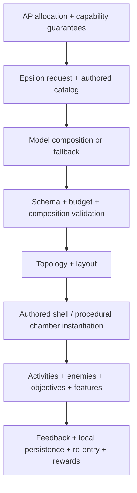
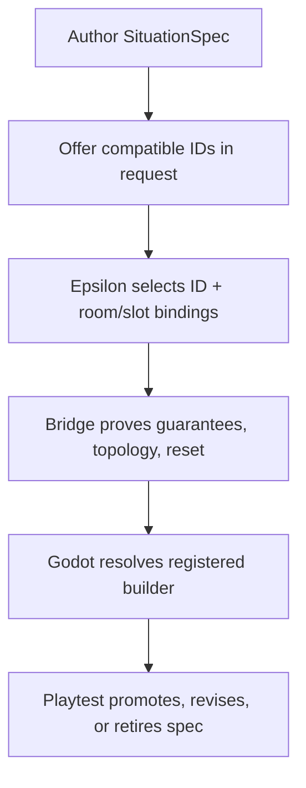

# Archipepsi room identity: from valid ingredients to meaningful relationships

**Independent research report — 22 September 2026**  
**Repository:** `cadykaya/archipepsi`  
**Inspected branch:** `claude/archipepsi-0-4-blindside`  
**Pinned commit:** [`52add15be07cf20d1b352b62a6fafa9367808995`](https://github.com/cadykaya/archipepsi/tree/52add15be07cf20d1b352b62a6fafa9367808995)  
**Prompt baseline:** `98c54776a46b55f96ecf517470b2b2733de1a306`  

## Executive answer

Archipepsi's ordinary generated rooms are not short of objects, mechanics, or graph structure. They are short of **authored relationships that give those things a job**.

The strongest current evidence is unusually concrete:

- The checked-in 20-zone sample contains **407 rooms, 552 activities, 708 enemies, 81 elevated rooms, 92 authored-shell rooms, and 300 rewards**. It is not empty in the literal sense.
- Yet its room vocabulary collapses to **200 `arena` rooms with `kill_all`, 100 `platform_path` rooms with `platform_to_goal`, and 107 corridors**. None of the 552 activities is ordered; all 111 timed activities are `timed_run`; ordinary sample zones contain **zero rail networks, zero zone-state variables, and zero featured acquisitions**.
- `ActivityPrimitive` can say kind, count, timer, order, and up to two guaranteed capabilities. It cannot say *what an element reveals, blocks, threatens, enables, changes, or makes worth revisiting*.
- `composition.py` distinguishes encounters by enemy archetype/count and identifies landmarks by content value. `content_value.py` scores accepted ingredients. Those are useful validity and anti-uniformity checks, but neither represents the experience the player is meant to have.
- The engine already contains a much richer action/status alphabet, competent surface-aware activity placement, three working enemy behaviours, local persistence, branching, authored shells, and several development scenarios. New rail, featured-acquisition, and cross-room-state contracts extend that frontier. The ordinary composer does not yet assemble those capabilities into normal campaign situations.

The diagnosis is therefore not “add more content” or “replace procedural generation.” It is:

> **Keep the validated authored alphabet, but make the unit of composition a situation with perceivable causal and spatial relationships—not a bag of independently valid ingredients.**

The lowest-risk path is to prove that thesis with three authored, controlled comparisons before changing the generator. If players do not notice more choices, form better causal explanations, remember the rooms more accurately, or prefer to revisit them, reject or narrow the thesis. This report proposes those experiments and the exact code/authoring seams they would exercise.

## 1. What is fact, what is historical, and what remains a hypothesis

| Status | Finding | Confidence and limit |
|---|---|---|
| **Confirmed current** | The active branch head is `52add15…`, not the prompt's `98c5477…`. The head message is “Four contract corrections, and lane-prefixed finding IDs.” | High; direct Git inspection on 2026-09-22. |
| **Confirmed current** | The focused Python bridge set passed: **471 tests** covering composition, content value, cross-room state, fallback scale/variety, featured acquisition, layout, rail networks, shell catalog, and topology. | High for those tests only. No Godot binary was available, so this study did not run the engine suites. |
| **Confirmed current** | The ordinary checked-in sample has the quantities summarized above, including no rail/state/acquisition emission. | High for `godot/tests/fixtures/sample/zone_01.json` through `zone_20.json`; this is a checked-in representative fixture, not a fresh playthrough. |
| **Confirmed current** | Three of ten declared enemy roles have behaviour (`melee`, `ranged`, `brute`). Ranged attacks have a 0.45 s commitment/windup and brutes 0.5 s; old “no windup” findings are stale. | High; executable Godot source and constants. The seven other entries are physical envelopes, not behaviours. |
| **Confirmed current** | Railways build in a dedicated engine scenario; featured acquisition and cross-room zone-state schemas/topology exist. Ordinary composition emits none of them. The engine half of cross-room state is explicitly unfinished. | High; source plus `docs/AGENT_FRONTIER.md`. “Tested scenario” does not mean “played ordinary campaign.” |
| **Confirmed current** | Activity placement handles occupancy, support, target mounting/facing, and usable firing positions. Runtime activities are still four trigger-rule families and grant local completion/reward effects rather than AP Checks or general progression. | High; source. Correct placement should be preserved. |
| **Historical observation** | In the 2026-09-13 playtest at `cd620f0`, the owner completed a 23-room fallback zone and liked its art, a ramped second floor with enemies, an accidental capability gate, a station repaired by an activity, and the dangerous mood of large dim rooms. They disliked purposeless activities, a puzzle beside an unlocked reward, target rows, shallow branches, missing map support, races/simultaneous plates, and enemies without a job. | High as dated first-hand evidence, but it describes an older commit and one player/session. Several correctness and feedback defects have since been repaired. |
| **Leading hypothesis** | Normal composition is optimized for quantity, validity, and categorical variety more than for causal/spatial relationships. | Medium-high. The schema, fallback, metrics, and sample support it. Only human comparisons can establish its experiential importance. |
| **Alternative hypothesis** | The dominant issue is combat/movement feel: direct steering, narrow enemy behaviours, movement-to-space ratios, or weak resource pressure make even well-related layouts flat. | Plausible. The encounter prototype controls shell, roster, and stats so placement/relationships can be isolated before expanding AI. |
| **Alternative hypothesis** | The rooms contain usable relationships, but feedback, navigation, or visual hierarchy prevents players from perceiving them. | Plausible. Historical legibility failures were severe. Perception and recall measures must be included in every prototype. |
| **Alternative hypothesis** | The intended hybrid lacks a settled lead experience; puzzle, expressive combat, and curiosity-led exploration repeatedly interrupt one another. | Plausible taste/product question. The report recommends distinct room/zone emphases and transition spaces rather than blending every pillar everywhere. |

### A compact definition of room identity

A useful room identity has three separable dimensions:

1. **Recognition:** “I know which place this is and what kind of place it might be.” Shape, silhouette, light, sound, landmark, and atmosphere do this.
2. **Adaptation:** “Being here changes what I notice, infer, choose, or do.” Geometry, enemies, devices, resources, and rules do this when they are related.
3. **Consequence:** “What I do here changes something I care about now or later.” A route opens, a risk changes, a destination becomes legible, knowledge transfers, or the room reads differently on return.

A room can legitimately major in only one dimension. A quiet overlook can be excellent because it establishes geography and anticipation. A tiny connector can be memorable because it becomes a shortcut. The mistake is not “too little interaction”; it is **no legible contribution to the player's model of the place**.

## 2. Method and evidence boundaries

### Repository work actually performed

The live branch was cloned read-only and inspected from allocation/schema through composition, layout, instantiation, runtime, persistence, representative fixtures, and current project records. No repository file was modified.

The prompt baseline-to-head delta is small but conceptually important: five files changed (182 insertions, 41 deletions). A zone-state variable may now have a **local reader as feedback provided at least one reader is remote**; cross-room held mechanics are clarified as **unsupported by the current contract, not inherently unfair or removed from the accepted design**; physical setter operability and walked return are separated from abstract reachability; and non-adjacent/branching rail spans are identified as unbuilt engine scope rather than forbidden design. The new tests cover the corrected reader rule. These corrections strengthen this report's emphasis on local feedback, physical acceptance, and carefully scoped state without claiming the larger mechanics already work.

The following command-equivalent focused suite was run at `52add15…`:

```text
pytest -q \
  bridge/tests/test_composition.py \
  bridge/tests/test_content_value.py \
  bridge/tests/test_cross_room_state.py \
  bridge/tests/test_fallback_scale.py \
  bridge/tests/test_fallback_variety.py \
  bridge/tests/test_featured_acquisition.py \
  bridge/tests/test_layout.py \
  bridge/tests/test_rail_network.py \
  bridge/tests/test_shell_catalog.py \
  bridge/tests/test_topology.py

471 passed in 7.59 s
```

There was no `godot`/`godot4` executable or repository-local Godot binary, so no engine suite or new gameplay session was run. Godot pass counts quoted from `AGENT_FRONTIER.md` are project records, not independently reproduced results.

### External research method

The comparison set was researched with a deliberately mixed evidence stack:

- original developer talks, commentary, documentation, interviews, public editors, and postmortems for intention and process;
- first-hand professional reviews for a described play experience;
- dated Steam, Reddit, and forum discussions where disagreement itself is useful;
- official store/press materials only for feature or release-state verification, not proof of enjoyment.

The study did **not** conduct a representative player survey, calculate sentiment percentages, or personally play the comparison games. Player evidence is a purposive convenience sample chosen to expose mechanisms and counterexamples. A lone review or thread is treated as testimony, not consensus. Current early-access games—especially **Monomyth**, **Selaco**, and **Supraworld**—are labeled as such, because their design and reception can change.

### The analytical chain

Every extended case is reconstructed through the same chain:

> **Entry/framing → perception → belief about possibility → choice or inference → action/opposition → feedback → lasting consequence → return**

The point is not to force all rooms into one template. It is to locate where a room earns its identity—and where an Archipepsi contract currently loses that information.

## 3. The current Archipepsi pipeline



The pipeline is not absent. The loss occurs mainly between **B and C**: the request can ask for valid room ingredients and capabilities, but the ordinary activity/encounter contract carries little information about why those ingredients belong together. Later stages cannot reconstruct an unexpressed causal role. Placement can make every target reachable and still place “three targets in a row.”

### Representative ordinary-campaign census

Source: the checked-in fixture `godot/tests/fixtures/sample/zone_01.json` through `zone_20.json` at `52add15…`.

| Measure | Count | What it does and does not establish |
|---|---:|---|
| Zones / rooms | 20 / 407 | Substantial sample volume; not live play. |
| Room types | 200 arena; 107 corridor; 100 platform path | Very narrow structural grammar in the ordinary sample. |
| Objectives | 200 `kill_all`; 100 `platform_to_goal` | Every arena and path has the same objective within its type. |
| Activities | 552 | High literal activity density. |
| Activity mix | 162 target; 141 pressure; 138 switch; 111 timed run | Category variety, but no dependency/consequence information. |
| Activities per room | 46×0; 190×1; 151×2; 20×3 | 361/407 rooms contain at least one activity. |
| Ordered activities | 0 | The order dial is unused here. |
| Enemy groups / bodies | 228 / 708 | Combat is not missing by count. |
| Enemy bodies | 438 melee; 250 ranged; 20 brute | Roster and frequency are strongly skewed. |
| Elevation / authored shell | 81 / 92 rooms | Spatial variety mechanisms reach the sample. |
| Rail networks / zone-state variables / featured acquisitions | 0 / 0 / 0 | New frontier capabilities do not reach ordinary sample generation. |
| Rewards | 300 | Reward quantity does not guarantee that an activity earns or changes one. |

`zone_01` illustrates the compression. `c002` is an arena with five ranged enemies, two target challenges, and `kill_all`; `c003` is a platform path with two pressure-routing activities and `platform_to_goal`; `c004` is a corridor with two timed runs. Each is busy, valid data. None of those declarations says how the enemies, targets, routes, and consequences are related.

### Capability-to-campaign integration matrix

| Capability | Executable/schema reality | Ordinary campaign reach | Design conclusion |
|---|---|---|---|
| 28 Echo action primitives | Godot declares all 28 implemented, spanning attacks, movement, defence, recovery, and utility. | Available through interpreted/loadout Echoes; an individual player may not have or slot each one. | Rich action space exists. Do not author a gate without a campaign guarantee and current-slot feedback. |
| Status interactions | 24 status names; 13 currently implemented with target-specific support. `lightened` drives the Unweighted Switch scenario. | Some runtime availability; ordinary activity grammar cannot bind statuses into causal puzzles. | Existing capability needing better content first, then bounded campaign integration. |
| Four activity families | Built, placed, labelled, timed/ordered/capability-gated, feedback-enabled. | Extremely common in ordinary fixtures. | Placement/runtime maturity is not the missing layer; semantic dependency and consequence are. |
| Enemy behaviours | Melee, ranged, brute with distinct stats and telegraphs. Seven other role envelopes exist only as spatial declarations. | Three behaviours appear; ordinary schema specifies archetype/count, not tactical anchor or job. | Test placement/geometry roles before paying for seven new AIs. |
| Elevation and authored shells | Supported and present in 81 and 92 sample rooms. | Integrated. | Use as relationship hosts, not value multipliers or decoration alone. |
| Keys, locks, branches, return/warp devices | Runtime persistence and graph support exist; historical campaign used them. | Integrated, but branch purpose varies. | Branch count is not choice quality. Add route roles and re-entry tests, not a larger depth cap by default. |
| Rail network | Schema, validated docks/spans, and Godot scenario/runtime exist. | No normal composer/sample emission. | Existing capability needing campaign integration, but only after a situation gives the railway a reason to matter. |
| Featured acquisition | Schema binds a guaranteed location/capability/room and topology consumes it. | No normal composer/sample emission. | Valuable for deliberate “see obstacle → acquire → reinterpret” zones; composer integration is unfinished. |
| Cross-room zone state | Schema/topology represent reversible/permanent state with setters/readers and macro-state search. | Engine half and composer emission explicitly unfinished. | Finish only behind one proved cross-room prototype; avoid a generic global signal bus. |
| Local activity consequence | Completion feedback, local reward, and one shared station repair path. | Integrated but narrow; multiple activities may share a consequence already consumed. | “Completed” must name what changed. Do not imply every activity has earned a unique world effect. |
| Map/navigation support | Room-entry tracking and truthful descriptions of known/unknown lock consequences exist. | Historical owner still got lost; no full map was reported in the inspected path. | Navigation is a player-memory interface, not a substitute for coherent spatial identity. Prototype a minimal visited-topology view before a maximal automap. |

### What the present metrics are good for

`content_value.py` correctly refuses to reward Checks and caps the value of empty space; `composition.py` rejects long connector runs, fully uniform encounter signatures, a full-size zone with no combat, one with no breathing room, and zones without a high-value landmark. These are useful **guardrails**.

They are not experience specifications:

- `[(ranged, 3)]` and `[(ranged, 3)]` are identical encounter signatures even if one fight is a crossfire over a moving bridge and the other is three idle bodies in a square.
- Two different signatures may still be solved with the same universally safe tactic.
- A room can become a “landmark” by value without becoming recognizable, behaviourally distinct, or structurally important.
- Activity points rise with element count, timer, and order, not with clue quality, dependency, consequence, or recovery.

The right move is not to delete the guardrails. It is to put a **situation contract upstream** of them and ask the metrics to validate that situation rather than stand in for it.

## 4. Cross-genre findings: what makes a space enjoyable

### 4.1 A room's identity is usually a relationship, expressed through space

Across the evidence, memorable spaces can often be summarized as a relationship rather than a noun:

- Portal Chamber 15: **the quick route players can physically run competes with the portal inference the chamber is meant to teach**; Valve slowed the literal route to make the conceptual route legible ([commentary transcript](https://combineoverwiki.net/wiki/Developer_commentary/Portal)).
- Outer Wilds' Brittle Hollow: **the place is being destroyed while the player explores it**, so elapsed time changes routes and access; praise for discovery coexists with frustration about repeated approaches after death ([positive review](https://www.gamespot.com/reviews/outer-wilds-review-extraterrestrial-investigation/1900-6417163/), [critical account](https://gamecritics.com/mike-suskie/outer-wilds-review/)).
- Unweighted Switch: **the crate needed as a step is also heavy enough to close the required shutter**; `lightened` changes the relevant class without removing the crate's height.
- Resident Evil 2's RPD main hall: **a safe orientation hub becomes permeable to danger**, changing the meaning of a known place ([making-of interview](https://www.pcgamer.com/the-making-of-resident-evil-2-remakes-raccoon-city-police-department/)).
- Quake's vertical spaces: **a bridge first seen from below becomes traversable from above**, making return and elevation part of the same mental model ([Romero interview](https://www.gamesradar.com/the-making-of-quake/)).

This suggests a more useful generator question than “which ingredients fit the budget?”:

> **What relationship should the player discover or exploit here, and which surfaces, threats, devices, routes, and feedback make that relationship perceivable?**

### 4.2 Small, large, quiet, and empty rooms

**A good small room** compresses a decision. It can expose one enemy tell, one reversible device, one observation-to-action loop, or one resource commitment with little walking between hypothesis and result. Portal's early chambers and Neon White's short stages benefit from a tight feedback loop: perceive, try, learn, retry.

**A good large room** gives distance a purpose. It may preview an unreachable destination, support different combat ranges, make a moving object legible, establish a landmark, expose simultaneous systems, or turn traversal into commitment. A large room whose contents do not use distance is merely a longer reset and search cost.

**A good quiet room** controls contrast and cognition. It can let the player form a map, notice a changed route, recover resources, inspect a new ability, or anticipate a threat. ULTRAKILL's developer explicitly describes downtime as a contrast that intensifies subsequent bursts ([developer interview](https://80.lv/articles/ultrakill-devs-on-the-game-s-mechanics-npc-ai-and-early-access-experience)).

**Meaningful emptiness** therefore has evidence: a view, a sound, a landmark, a safe observation point, a before/after state, or a pacing job. The historical Archipepsi observation that big dim rooms felt dangerous is promising—but it should be converted from accidental mood into a supported expectation, such as a visible exposed crossing with uncertain opposition, not “fixed” by sprinkling more targets.

### 4.3 Puzzle insight, simple interaction, and busywork

An **insight puzzle** changes the player's model. The action after the insight may be easy. The Witness' designer describes each panel as an idea rather than merely an object to complete; the game teaches a grammar and then asks the player to perceive it in new contexts ([Jonathan Blow interview](https://time.com/4355763/the-witness-jonathan-blow-interview/)). Antichamber makes apparently arbitrary spatial behaviour useful only because the strange rules remain consistent enough to learn ([developer interview](https://www.gamedeveloper.com/audio/interview-navigating-an-em-antichamber-em-of-sound-and-mysteries)).

A **simple interaction** can still be satisfying when its consequence is useful and immediate: unlatch a shortcut, restore a station, rotate a bridge, turn on a light that reveals an already suspected route. It need not pretend to be a puzzle.

Busywork appears when:

- the correct sequence is visible from the start and the remaining cost is travel or input repetition;
- an action produces no perceived consequence;
- the relationship is arbitrary or hidden, so progress comes from exhaustive interaction;
- failure erases setup without adding information;
- a powerful movement option turns a timing exercise into a formality.

This supports the owner's retirement of standalone races and simultaneous-plate drills. Their useful atoms—timed exposure, pressure as live state, and a plate that triggers a reveal—can remain inside situations where they create a decision.

### 4.4 Teaching rules without over-explaining

Strong teaching sequences separate four moves:

1. **Demonstrate:** the player can observe a rule with low consequence.
2. **Confirm:** they deliberately reproduce it.
3. **Combine:** the known rule interacts with another known rule.
4. **Invert or transfer:** the same rule solves a superficially different problem.

Portal's commentary repeatedly describes revising spaces when playtesters learned the wrong thing. A timed, self-moving portal taught people to wait, so Portal 2 changed the “portal carousel” relationship rather than adding instructional prose ([commentary transcript](https://combineoverwiki.net/wiki/Developer_commentary/Portal_2)). Croteam's public editor similarly starts from an objective, connects devices logically, tests the intended and unintended solution, and decorates afterward; it also recommends boundaries that clarify which elements belong to a puzzle ([editor documentation](https://taloseditor.croteam.com/building_a_level/)).

For Archipepsi, this argues for a **rule ledger per campaign/zone**, not a mandatory tutorial in every room. Epsilon may select `demonstrate`, `confirm`, `combine`, or `invert` only for rules the campaign has established. Validation can prove prerequisite order; human playtests must prove the player actually learned it.

### 4.5 Combat identity comes from enemy–space–resource relations

The same three ranged enemies can make different decisions if their jobs differ:

- one watches an exposed crossing but can be occluded by moving cover;
- one guards a control that opens a safe flank;
- one fires a readable projectile the player can redirect into machinery;
- one pins the player while melee pressure makes staying in cover costly.

ULTRAKILL is a useful counterexample to “better AI means deeper combat.” Its developer keeps AI deliberately predictable so extreme movement and enemy positions remain readable; clean geometry supports that speed ([developer interview](https://80.lv/articles/ultrakill-devs-on-the-game-s-mechanics-npc-ai-and-early-access-experience)). CULTIC similarly derives tactical depth from consistent enemy behaviour that can be learned ([developer interview](https://www.dreadcentral.com/interviews/488016/cultic-jason-smith-tells-all-there-is-to-tell-about-the-upcoming-horror-fps/)).

Therefore, new enemy roles should follow—not precede—evidence that the current trio cannot support enough distinct decisions. First add authored spawn anchors/jobs to prototypes, keeping stats and roster fixed. If players still converge on one tactic, the result justifies AI/attack extensions with a named missing pressure.

### 4.6 Combat can support exploration—or erase it

Combat supports exploration when it:

- makes a route choice risky in a legible way;
- changes what counts as cover, high ground, or a safe return;
- consumes a resource that gives optional detours value;
- guards information or a shortcut whose value is understood;
- turns known geometry into a different problem on revisit.

It interrupts exploration when it respawns too often, blocks inspection, demands the same solution, or exists only because a full-size zone is required to contain combat. Supraland's creator later described the original combat as effectively pointless, while its exploration and puzzle interactions were the draw ([developer interview](https://www.pcgamer.com/how-first-person-metroidvania-supraland-became-a-hit-and-whats-in-store-for-the-sequel/)). The answer is not to prohibit combat; it is to give each encounter a reason to be in that route at that moment.

Rooms with no combat are legitimate. The current full-size-zone rule requires combat **somewhere**, not everywhere, and that distinction should remain.

### 4.7 Good revisits change interpretation; bad revisits repeat cost

The best revisit has at least one delta:

- **ability delta:** an old barrier becomes a route or shortcut;
- **knowledge delta:** the player now recognizes a clue or destination;
- **state delta:** water, machinery, power, enemies, or topology changed;
- **mastery delta:** the same route can be traversed faster or more expressively;
- **purpose delta:** a former transit room is now the approach to a goal.

Metroid Prime's artifact hunt exposes the disagreement. One first-hand critique calls it an endgame pacing tax; players in a dated discussion defend it as an opportunity to use late abilities, collect missed upgrades, and feel full power, while others identify a painful middle case where the player has already explored thoroughly but did not know artifacts would become mandatory ([critique](https://www.escapistmagazine.com/metroid-prime-remastered-is-a-masterpiece-except-for-the-chozo-artifacts/), [player disagreement](https://gamefaqs.gamespot.com/boards/395915-metroid-prime-remastered/80428809)).

The transferable rule is not “backtracking good” or “backtracking bad.” It is: **preview mandatory return goals early, attach revisits to new value, and reduce repeated traversal whose meaning has not changed**.

### 4.8 Navigation should preserve discovery while externalizing known facts

Landmarks, silhouettes, lighting, audio, views, doors, and route geometry should help a player *learn* a place. A map should preserve what they have already learned: visited topology, known locked exits, visible but unreachable goals, and state changes. It should not reveal undiscovered branches by default.

Resident Evil 2's RPD benefits from a strong central hub and a map that records seen items/incomplete rooms, while threat can invade known routes. Metroid Prime's 3D map exposes known exits and points of interest without solving traversal ([contemporary review](https://www.gamespot.com/reviews/metroid-prime-review/1900-2897768/)). Nintendo's Water Temple revision is a warning against blaming a spatial concept for interface friction: faster Iron Boots and easier map checking addressed major pain without deleting the whole-state dungeon idea ([Iwata Asks](https://www.nintendo.com/en-gb/Iwata-Asks/Iwata-Asks-The-Legend-of-Zelda-Ocarina-of-Time-3D/Vol-4-Development-Staff/3-I-ve-Got-to-Fix-the-Water-Temple-/3-I-ve-Got-to-Fix-the-Water-Temple--235888.html)).

Archipepsi should first prototype a **visited-only topology view** with room silhouettes/roles, known gates, player position, and named persistent changes. Avoid objective GPS through unknown walls and avoid a fully revealed schematic.

### 4.9 Movement upgrades must be tested in both traversal and combat

Mooncrash designer Ricky Llamas identified lack of quick lateral movement as a combat problem, prototyped propulsion changes under low gravity, broadened the lateral thrust, and retained a well-liked ground slam; an upward-thrust idea was cut when the hub lost the verticality that justified it ([first-person design account](https://www.rickyllamas.com/prey-systems-927369.html)).

That process matters more than the specific move. Every Archipepsi movement capability should be evaluated against:

- authored traversal it unlocks;
- older obstacles it intentionally trivializes;
- combat ranges and enemy tells it changes;
- camera/readability and recovery after failure;
- variable loadouts and what the campaign can guarantee.

Progression is satisfying when the player recognizes that an old constraint has become expressive freedom. It is broken when the upgrade silently bypasses a progression Check, removes all combat exposure, or converts every future timing challenge into dead content.

### 4.10 Failure should buy information

A useful failure answers “what was wrong with my model or execution?” and makes the next attempt cheap enough to test that answer. Viewfinder's rewind directly lowers experimentation cost; Talos' editor documentation explicitly calls for testing cheese/unintended solutions; Neon White makes retrying a short route nearly immediate.

Separate:

- **conceptual failure:** wrong causal model;
- **perceptual failure:** relevant clue/tell was not seen;
- **execution failure:** model was right, input/timing was not;
- **state failure:** an object or route became unrecoverable;
- **navigation failure:** player knows the goal but cannot relocate it.

Archipepsi telemetry and playtest notes should tag these categories. A completion time cannot tell them apart.

### 4.11 What should be authored and what can vary

The evidence supports hybrid generation, not a choice between hand-authored and random:

| Preserve through authorship/contract | Safe variation after validation |
|---|---|
| causal dependencies and allowed state transitions | exact eligible shell from a compatible family |
| what is visible from entry and after each reveal | cosmetic dressing, theme, non-critical props |
| enemy jobs, pressure lanes, and minimum/maximum ranges | eligible archetype substitution within a tested role envelope |
| mandatory capability guarantees and recovery path | optional reward identity and some side branches |
| consequence, persistence scope, and return-state delta | bounded spatial offsets that preserve sightline/route proofs |
| teaching prerequisite and rule-transfer intent | counts inside a tested range, if they do not alter the insight |

Dead Cells is the clearest procedural precedent. Motion Twin hand-authored purpose-specific tiles, assigned them to biome-specific concept graphs, then let the generator select compatible rooms; enemy placement also observes spatial constraints. The stable world layout, tile purpose, biome identity, and pacing graph survive variation ([developer postmortem](https://deepnight.net/tutorial/the-level-design-of-dead-cells-a-hybrid-approach/)).

Archipepsi's authored-shell direction is already compatible with this model. The missing step is to catalog **situations and roles**, not simply more shells.

## 5. Sixteen extended case studies

These cases were selected for transfer value, disagreement, and contrast—not reputation. “Observed” below means reported in the cited source, not personally played during this study.

### 5.1 Portal (2007): Chamber 15 versus the early training chambers

**Early chambers.** Entry framing isolates one new fact; high-contrast portalable surfaces and endpoints narrow perception; the player confirms a rule with low reset cost. Portal's commentary says early versions allowed players to stumble forward without understanding, so the team strengthened layered training and visual hot spots ([commentary](https://combineoverwiki.net/wiki/Developer_commentary/Portal)).

**Chamber 15.** Playtesters could physically run between spaces and treat that as the solution. Replacing stairs with slow lifts equalized travel time and made portal reasoning the attractive interpretation ([commentary transcript](https://combineoverwiki.net/wiki/Developer_commentary/Portal)).

**Chain:** test-chamber frame → highlighted affordances → “portals connect these spaces” → compare literal travel with portal travel → place/enter portals → immediate relocation confirms → the learned relationship transfers later.  
**Archipepsi lesson:** a valid route can teach the wrong rule. Validation needs to preserve intended alternatives, while a human test asks which model players actually form. Do not solve teaching failures with labels alone.

### 5.2 Portal 2 (2011): Portal Carousel versus excursion-funnel/gel escalation

**Portal Carousel.** An earlier timed, self-moving portal caused players to stare and wait until alignment happened; redesign changed the action the room rewarded. The developer description explicitly frames this chamber as teaching that two portal endpoints connect places ([commentary](https://combineoverwiki.net/wiki/Developer_commentary/Portal_2)).

**Late mobility chambers.** Funnels and gels combine known portal placement with trajectory, surface treatment, and timing. Their identity comes from *which motion relationship* is under examination, while scenery and dialogue support pacing rather than adding unrelated tasks. Valve's chamber process focused each room on a key mechanic, rapid blockout, and removal of unintended solutions that felt broken rather than clever ([process account](https://gameinformer.com/b/features/archive/2010/03/17/thinking-with-portals-making-a-test-chamber.aspx)).

**Chain:** readable apparatus → predict motion → choose portal/surface sequence → launch/redirect → continuous trajectory feedback → reach a visibly meaningful endpoint → reuse the rule in a denser combination.  
**Archipepsi lesson:** “two devices plus traversal” is not yet a situation. Name the motion/causal relationship, provide a prediction view, and distinguish satisfying alternative solutions from accidental bypasses.

### 5.3 The Talos Principle 2 (2023): regional puzzle fields versus the Megastructure bridges

**Regional numbered puzzles.** Distinct bounded compounds reduce visual ownership ambiguity. Devices are logically linked to barriers/objectives; optional roaming between compounds provides scale, lore, and recovery. Croteam says it used testing/prototyping principles to create a progression that teaches new players while avoiding pure repetition for veterans ([developer interview](https://exputer.com/interviews/the-talos-principle-2-interview/)).

**Megastructure tetromino-bridge interludes.** Reviews that praise the broader puzzle design repeatedly identify these bridge assemblies as less interesting or overextended, especially the longer second visit ([PC Gamer](https://www.pcgamer.com/the-talos-principle-2-review/), [New Game Network](https://www.newgamenetwork.com/article/2721/the-talos-principle-2-review/)). This is a useful counterexample: a mechanically valid interlude can become pacing friction when its operation yields little new inference.

**Chain:** bounded frame → identify owned devices/goal → infer links → rearrange/test → barrier/beam feedback → collect progress → later puzzles recombine the rule.  
**Archipepsi lesson:** puzzle boundaries can clarify ownership without forcing every room into a test chamber. Repeated bridge assembly warns against using one execution-heavy connector activity as compulsory connective tissue.

### 5.4 Outer Wilds (2019): Brittle Hollow versus the Hourglass Twins

**Brittle Hollow / Southern Observatory routes.** Meteor impacts progressively remove crust into a black hole. The player sees inaccessible ruins and learns that both time and falling can reroute them, including through the black hole to White Hole Station. Discovery links local text, physical change, and remote destinations. Positive accounts praise the solar system as a web of related clues ([PC Gamer](https://www.pcgamer.com/outer-wilds-review/)).

**Hourglass Twins / Sunless City approaches.** Sand transfers between planets, opening some paths and burying others. The same time structure that creates anticipation also creates repeated setup and deadline pressure; critical accounts describe retries and timing gates as frustration rather than curiosity ([critical review](https://gamecritics.com/mike-suskie/outer-wilds-review/), [player discussion](https://steamcommunity.com/app/753640/discussions/0/3071999401475459456/)).

**Chain:** visible celestial process → infer a temporal opportunity → choose destination/order → navigate changing hazards → environmental change confirms → knowledge, not inventory, persists → return is shorter because the player knows when/where.  
**Archipepsi lesson:** curiosity can be a real reward, but only if the new knowledge reduces uncertainty more than the loop repeats travel. Cross-room state should expose what changed and provide recovery, not create off-screen arbitrary outcomes.

### 5.5 The Witness (2016): Orchard versus Shady Trees

**Orchard.** Panel solutions are grounded in nearby apple-tree structure. The player learns that the three-dimensional environment can be evidence for a two-dimensional panel. The room's identity is an observation relationship, not a new verb.

**Shady Trees.** Cast shadows become the rule-bearing signal, then occlusion and damaged/ambiguous traces complicate it. Regional art and vegetation act as both identity and clue. Blow describes panels as ideas and the whole game as encouraging fresh perception; the New Yorker notes both the hand-designed permutations and the lack of hints that can make prolonged blockage feel hostile ([TIME interview](https://time.com/4355763/the-witness-jonathan-blow-interview/), [profile/critique](https://www.newyorker.com/tech/annals-of-technology/the-prickly-genius-of-jonathan-blow)).

**Chain:** distinct region → notice panel/environment correspondence → form a rule → trace solution → clean accept/reject → rule becomes portable → return reveals previously invisible environmental puzzles.  
**Archipepsi lesson:** visual identity can carry gameplay evidence. But “no hints” is not intrinsically respectful; record when players are testing a plausible hypothesis versus searching without a model.

### 5.6 Antichamber (2013): the looping corridor versus the gap that punishes jumping

**Looping corridor.** Walking around what appears to be the same circular route twice leads somewhere new. The conflict is between learned real-world navigation and a consistent local rule.

**Gap crossing.** Jumping causes the player to fall; simply walking across keeps them suspended. The developer uses these examples to distinguish brute-force logical selection from lateral reframing, while acknowledging that rules initially seem arbitrary until their consistency becomes apparent ([developer interview](https://www.gamedeveloper.com/audio/interview-navigating-an-em-antichamber-em-of-sound-and-mysteries)).

**Chain:** minimalist frame → normal-world expectation → unexpected outcome → question the assumption → try a simpler/different action → strong spatial feedback → learned distrust/consistency changes future reading.  
**Archipepsi lesson:** surprising exceptions are fair only if they establish a reusable grammar. Epsilon should not invent one-off rules; it can select a documented rule transformation whose prior teaching is guaranteed.

### 5.7 Lunacid (1.0, 2023): Temple of Silence versus Sanguine Sea / Holy Battlefield

**Temple of Silence.** In a dated player discussion, one player identifies it as tense and distinct, with atmosphere and exploration carrying the game. Movement growth—speed, jumping, directional dashes—makes traversal itself part of discovery.

**Sanguine Sea, Forlorn Arena, Holy Battlefield.** The same thread disputes whether large rooms are full of tucked-away discoveries or simply oversized and underused; participants name particular regions on both sides ([Steam discussion](https://steamcommunity.com/app/1745510/discussions/0/4030220670868463078/)). Combat is also criticized as becoming trivial once mobility grows.

**Chain:** strong audiovisual threshold → suspect danger/secrets → choose to search or move on → sparse combat/traversal → discovery or atmosphere validates the search → upgrades change reach → return can become expressive or merely long.  
**Archipepsi lesson:** large/quiet space needs a supported expectation. “There might be something in any corner” can motivate once, but repeated low-yield scanning teaches players to stop believing the level.

### 5.8 Legend of Grimrock 2 (2014): Twigroot Forest versus confined dungeon combat

**Twigroot Forest / Isle of Nex surface.** Moving the grid crawler outdoors gives regions distinct personalities and multiple directions; secrets and later access make the island a broader spatial puzzle ([GameSpot review](https://www.gamespot.com/reviews/legend-of-grimrock-2-review/1900-6415925/)).

**Confined encounters and “square dancing.”** Players debate whether circling enemies is a repetitive exploit or a tactical baseline. Replies note fast side-moving/instant-attacking enemies that punish the rote loop, while a detailed review credits level design and AI with making it harder, though not impossible ([player discussion](https://steamcommunity.com/app/251730/discussions/0/492378806374414698/), [review](https://rpgcodex.net/article.php?id=9695)).

**Chain:** grid geometry reveals manoeuvre space → assess whether circling is safe → choose formation/position/ability → enemies contest particular moves → predictable attacks show why the tactic worked/failed → resources persist → later spaces ask for a changed pattern.  
**Archipepsi lesson:** if one safe orbit solves all fights, more enemies only prolong the solved routine. Add one legible counter-pressure or geometry constraint at a time and observe adaptation.

### 5.9 Arx Fatalis (2002): Goblin Prison versus the wider interconnected dungeon

**Goblin Prison.** Social rules, objects, stealth, combat, and multiple approaches give a local problem several compatible verbs; the space feels inhabited rather than arranged solely as an encounter.

**The wider dungeon / mines and hubs.** Arkane's Ricardo Bare describes Arx as a large interconnected dungeon the player can roam as access opens, a structure later carried into Prey ([interview](https://www.pcgamesn.com/prey/prey-builds-characters-turret-lord)). Contemporary reviews praise detail and interactivity while acknowledging interface/jank and loading friction ([GameSpot](https://www.gamespot.com/reviews/arx-fatalis-review/1900-2898456/)).

**Chain:** diegetic location and occupants → perceive objects/routes/social constraints → choose stealth, violence, manipulation, or spell → systems respond consistently → access/resources/NPC state persist → return embeds the room in a living dungeon.  
**Archipepsi lesson:** systemic richness comes from verbs applying across contexts, not from every room supporting every verb. Catalog which existing Echo/status/physics interactions are safe in a given authored situation.

### 5.10 Metroid Prime Remastered (2023): Phendrana Drifts versus the Artifact Temple hunt

**Phendrana Drifts and ordinary ability returns.** Distinct climate, music, silhouettes, scan information, and visible magnetic/morph-ball routes make obstacles memorable. Later abilities change both reach and traversal speed. A contemporary review praises the continuous world and effective 3D map for showing known exits and points of interest ([GameSpot](https://www.gamespot.com/reviews/metroid-prime-review/1900-2897768/)).

**Artifact Temple/endgame hunt.** The temple turns cryptic clues into a mandatory global return. Some players enjoy the full-power victory lap and missed upgrades; others experience an unexpected completion tax, especially if they explored thoroughly without knowing artifacts would become mandatory ([critique](https://www.escapistmagazine.com/metroid-prime-remastered-is-a-masterpiece-except-for-the-chozo-artifacts/), [disagreement](https://gamefaqs.gamespot.com/boards/395915-metroid-prime-remastered/80428809)).

**Chain:** distinctive region → spot coded obstruction → remember capability family → acquire/return → obstacle opens with clear feedback → shortcut/item alters route → repeated returns either demonstrate mastery or become commute.  
**Archipepsi lesson:** featured acquisitions can create legitimate remembered gates, but mandatory collections must be previewed and route-planned. Never make optional-looking Checks become a late surprise requirement.

### 5.11 Supraland (2019): the chapel “halo” puzzle versus routine combat rooms

**Chapel halo.** The player dyes a wooden disc yellow and positions it over a character so it reads as a halo, changing access through an environmental/semantic inference. The same objects retain ordinary physical meaning while gaining a contextual one ([developer profile](https://www.pcgamer.com/how-first-person-metroidvania-supraland-became-a-hit-and-whats-in-store-for-the-sequel/)).

**Routine combat.** The creator described original combat as pointless because death did not matter, while the world, secrets, and puzzles carried the experience. His own design article values puzzles that can be “cheated” by transferring a learned trick into an unexpected context ([profile](https://www.pcgamer.com/how-first-person-metroidvania-supraland-became-a-hit-and-whats-in-store-for-the-sequel/), [design article](https://www.gamedeveloper.com/design/how-supraland-s-puzzles-are-different)).

**Chain:** playful world frame → notice color/shape/social expectation → infer representation → arrange ordinary objects → NPC/access response confirms → route/reward opens → the trick broadens the perceived solution space.  
**Archipepsi lesson:** a small situation can be memorable because several meanings intersect. Combat should not be inserted between such inferences unless it changes or protects the decision.

### 5.12 DUSK (2018): Head Cheese versus The Infernal Machine

**E1M1 Head Cheese.** A recognizable farmhouse and yard establish spatial/story identity while teaching speed, secrets, breakable routes, and enemy threat at modest scale. Familiar architecture makes deviation and hidden space legible.

**E2M4 The Infernal Machine.** Industrial machinery, vertical layers, moving structures, and denser combat make the level's environment itself the episode's premise. Szymanski argues that retro FPS identity lies heavily in level design rather than arena-heavy combat alone; interviews warn that modern throwbacks can over-focus on the combat loop ([developer interview](https://www.gamedeveloper.com/design/more-than-a-throwback-how-i-dusk-i-nails-the-best-parts-of-90s-fps-games), [level list](https://dusk.fandom.com/wiki/MissionNavbox)).

**Chain:** place fiction/landmark → infer navigable boundaries and secrets → choose route/exposure → enemies and machinery contest movement → pickups/doors/geometry provide feedback → secrets and keys alter progress → later episodes escalate spatial premise.  
**Archipepsi lesson:** a theme becomes behavioural when machinery, routes, enemy placement, and secrets use it. A “factory” art pack over interchangeable arenas is only visual identity.

### 5.13 ULTRAKILL (Early Access): 1-4 Clair de Lune versus 4-2 GOD DAMN THE SUN

**1-4 Clair de Lune.** A quiet manor and soft music create contrast before the V2 duel. The arena tests mastery against a rival with related mobility; the level's restraint makes the combat peak legible.

**4-2 GOD DAMN THE SUN.** Open desert arenas, skull routing, vertical mobility, optional challenge/secret paths, and the Sisyphean Insurrectionist encounter change the relationship between fight and traversal. Hakita later replaced a too-similar challenge partly to encourage fighting the enemy outside its original arena ([developer interview](https://intothebluesky.com/2021/10/05/follow-up-interview-with-hakita/amp/), [level reference](https://ultrakill.wiki.gg/wiki/4-2%3A_GOD_DAMN_THE_SUN)).

**Chain:** clean geometry and contrast → instantly read threats/routes → choose movement/weapon expression → predictable enemies combine into pressure → style, health, sound, and displacement respond → ranks/challenges reward mastery → replay reveals faster/stranger solutions.  
**Archipepsi lesson:** powerful movement needs clear geometry and predictable opposition. Room identity can be a specific movement-combat test, but constant maximal pressure would erase the contrast that makes it land.

### 5.14 Quake (1996): E1M1 Slipgate Complex versus E2M6 Dismal Oubliette

**E1M1 Slipgate Complex.** A gentle introduction uses loops, elevation, secrets, and a coherent industrial base. It demonstrates full-3D affordances without demanding an elaborate route.

**E2M6 Dismal Oubliette.** More elaborate vertical interconnection and a slow sinking/elevator-like reveal turn architecture into event and orientation challenge. Romero says Quake's level goal was to exploit verticality—being under a bridge and later on it—and separately emphasizes landmarks and immersion ([making-of interview](https://www.gamesradar.com/the-making-of-quake/), [older design interview](https://www.gamedeveloper.com/design/secrets-of-the-sages-level-design)).

**Chain:** landmarked volume → preview upper/lower routes → choose key/combat path → threats exploit height and corners → doors/lifts/secrets transform access → route loops back at a new elevation → return rewards a stronger mental model.  
**Archipepsi lesson:** elevation is not a binary room bonus. It matters when vertical layers create preview, crossfire, looping access, or a changed return.

### 5.15 Dishonored 2 (2016): Clockwork Mansion versus Dust District

**Clockwork Mansion.** Pulling levers transforms rooms; players can also move through the behind-the-walls mechanism. The mansion expresses its owner's identity, changes sightlines/routes, and supports stealth, combat, bypass, and observation. Arkane prototyped versions ranging from abstract machinery to almost normal house before finding the usable middle ([level-design deep dive](https://www.gamedeveloper.com/design/level-design-deep-dive-i-dishonored-2-s-i-clockwork-mansion)).

**Dust District.** A social/territorial problem can be approached through competing factions, information, traversal abilities, or the Jindosh lock; the spatial problem is coupled to world state and player intent rather than one required trick. Arkane describes its broader method as holistic: gameplay, presentation, and story working together ([GDC summary](https://www.gamedeveloper.com/design/video-i-dishonored-2-i-dev-shares-tips-on-holistic-level-design)).

**Chain:** authored place/power structure → observe guards, routes, mechanisms, social clues → select approach → systems and occupants respond → persistent objective/faction consequences → return reflects chosen manipulation.  
**Archipepsi lesson:** “many possible verbs” is valuable only when the space supplies reasons to choose among them. Epsilon should bind safe authored alternatives; it should not synthesize arbitrary machine logic.

### 5.16 Dead Cells (2018+): Ramparts versus Toxic Sewers

**Ramparts.** The biome's concept graph is comparatively direct, supporting forward momentum and readable combat/exploration beats.

**Toxic Sewers.** Tighter space constrains jumping/dodging and changes mob management. Motion Twin hand-authored purpose-specific tiles, tied them to biomes, arranged them with biome-specific graphs, then placed enemies under spatial constraints; the generator is downstream of those decisions ([developer postmortem](https://deepnight.net/tutorial/the-level-design-of-dead-cells-a-hybrid-approach/)).

**Chain:** biome identity and route graph → anticipate spatial pressure → choose path/build engagement → tile geometry changes enemy value → combat/loot feedback → exits/special rooms shape run → later runs vary arrangement while preserving biome meaning.  
**Archipepsi lesson:** procedural variety should permute within a semantic envelope. A shell needs purpose, compatible encounter roles, and a zone pacing position—not merely dimensions and sockets.

## 6. Complete coverage ledger: all 33 requested games

This ledger is deliberately compact; the sixteen entries above carry the deeper reconstructions. “Criticism” records a sourced objection or disagreement, not a verdict or a claim of consensus. Store pages are used only for release status or declared features, never as proof of enjoyment.

### 6.1 First-person puzzle games

| Game / version | Concrete space or contrast; praise and criticism | Archipepsi transfer |
|---|---|---|
| **Portal** (2007) | **Chamber 15** combines momentum, a moving platform, pellet redirection, and a final fling; early chambers isolate one relation at a time. The game is praised for economical teaching and escalation, while the final escape shows that the same portal grammar can support navigation and story rather than another sealed test. See extended study §5.1 and [Valve's Portal commentary transcript](https://developer.valvesoftware.com/wiki/Portal_Developer_Commentary). | Give a situation one learnable relation, then vary its use or context. A short training room is worthwhile if a later room asks the player to transfer—not merely repeat—the rule. |
| **Portal 2** (2011) | In the prototype **Portal Carousel**, timed moving portals made players wait and fear costly retries; Valve changed the interaction after watching that behavior. Later excursion-funnel and gel sequences create more expressive motion but also change pacing. The contrast is unusually direct evidence that a valid mechanic can still suppress experimentation ([commentary transcript](https://combineoverwiki.net/wiki/Developer_commentary/Portal_2)). | Measure hesitation, retry setup, and hypothesis rate. If a timing rule makes players watch instead of act, expose state or shorten recovery before adding complexity. |
| **The Talos Principle 2** (2023) | Regional fields let players complete eight of ten bounded device puzzles, preserving choice and clean puzzle borders; the repeated **Megastructure tetromino bridges** were called less interesting or an extended blemish by multiple reviews ([New Game Network](https://www.newgamenetwork.com/article/2721/the-talos-principle-2-review/), [PC Gamer](https://www.pcgamer.com/the-talos-principle-2-review/)). Croteam's editor guide explicitly says to establish objective, logically connect actors, test cheese, and decorate after function ([editor documentation](https://taloseditor.croteam.com/building_a_level/)). | Author the causal model before dressing or scoring a room. Optional puzzle choice can protect pacing; repeated low-insight connective tasks should not become mandatory merely because they are easy to generate. |
| **Outer Wilds** (2019) | **Brittle Hollow** changes topology as fragments fall, while the **Hourglass Twins** open and close routes as sand transfers. The changing worlds make knowledge and timing meaningful; some players object to waiting or repeating travel after missing a window ([GDC talk listing](https://www.gdcvault.com/play/1027368/Independent-Games-Summit-Sparking-Curiosity), [mechanical review](https://www.thesixthaxis.com/2019/07/16/outer-wilds-review/), [critical counter-reading](https://puzzlebyrinth.com/en/articles/counter-outer-wilds)). | A cross-room state should produce visible predictions and multiple useful windows. Knowledge can be the reward, but retries need a cheap re-entry path; do not copy a global time loop. |
| **The Witness** (2016) | The **Orchard** teaches that environmental features can disambiguate panel rules; **Shady Trees** turns actual light and shadow into input. The island's regions function as rule dialects, though the absence of conventional hints makes some failures feel like uncertainty about the question rather than its answer ([Game Developer interview](https://www.gamedeveloper.com/design/the-witness-designer-jonathan-blow-on-the-rules-of-the-game), [GameSpot review](https://www.gamespot.com/reviews/the-witness-review/1900-6416340/)). | Clues should be spatial evidence, not hidden metadata. Keep each authored situation's relevant set legible, and add a recovery clue when playtests show players cannot identify the rule family. |
| **Antichamber** (2013) | A corridor that loops until the player turns around and a gap whose message warns against jumping both establish alien but consistent relationships between observation and topology. Reviews praise discovery while noting that the same non-Euclidean language can leave players wandering without knowing whether they missed a rule ([designer interview](https://www.gamedeveloper.com/design/how-i-antichamber-i-bends-your-mind), [GameSpot review](https://www.gamespot.com/reviews/antichamber-review/1900-6403440/)). | Surprising exceptions become fair only if the world supplies a stable grammar and a nearby way to test it. Use such inversions sparingly; ordinary campaign generation should not invent arbitrary spatial laws. |
| **Manifold Garden** (2019) | Its repeating architecture and gravity shifts create powerful spatial revelation, but testers were “constantly lost.” The developers required level thumbnails to remain individually recognizable—such as a **diamond level** or **staircase level**—so navigation did not erase wonder ([design interview](https://www.gamedeveloper.com/design/designing-i-manifold-garden-i-s-believably-unbelievable-world-and-puzzles)). | Build recognizable silhouettes and transition logic before relying on a map. Structural weirdness raises, rather than lowers, the need for local identity. |
| **Superliminal** (2019) | Perspective resizing turns a small chess piece or doorway into usable geometry; later chapters vary presentation and expectation. Reviews praise the tactile perceptual trick but disagree on whether repeated resizing and makeshift stairs exhaust it, and some report finicky placement ([GameSpot](https://www.gamespot.com/reviews/superliminal-review-we-need-to-go-deeper/1900-6417507/), [Cubed3](https://www.cubed3.com/games/reviews/pc/superliminal-2), [Explosion Network](https://explosionnetwork.com/superliminal-review/)). | A strong verb is not an identity by itself. Ask what new relationship a room creates with it and whether control precision supports the inference. |
| **Viewfinder** (2023) | Photograph placement first creates a bridge, then duplicates scarce batteries, reorients teleporters, and interacts with cameras/copiers. The rewind makes destructive experiments cheap. Praise centers on invention; criticism says many rooms feel like tutorials for ideas the short game never fully develops ([GameSpot](https://www.gamespot.com/reviews/viewfinder-review-one-perfect-shot/1900-6418089/), [PC Gamer](https://www.pcgamer.com/viewfinder-review/), [The Guardian](https://www.theguardian.com/games/2023/jul/17/viewfinder-review-sad-owl-thunderful)). | Reversible experimentation is highly transferable. But a catalog must include combination and consequence situations, not only one-room demonstrations of each capability. |

### 6.2 First-person dungeon games

| Game / version | Concrete space or contrast; praise and criticism | Archipepsi transfer |
|---|---|---|
| **Lunacid** (1.0, 2023) | The **Temple of Silence** uses quiet, vertical ruins, doors, and secrets to create anticipation; **Sanguine Sea / Holy Battlefield** pushes scale and hostile traversal. Players praise area distinction and melancholy exploration but disagree over whether large spaces are evocative or empty and whether simple combat sustains them ([Steam discussion](https://steamcommunity.com/app/1745510/discussions/0/4030220670868463078/)). See §5.7. | Quiet rooms need an explicit experiential job—preview, dread, orientation, recovery, or search—not filler. Large volume cannot compensate for weak landmarks or low-value searching. |
| **Legend of Grimrock 2** (2014) | **Twigroot Forest** makes a grid crawler feel regional and open; confined fights invite lateral “square dancing.” Some players see that tactic as repetitive, while others cite fast enemies and geometry that punish it ([GameSpot](https://www.gamespot.com/reviews/legend-of-grimrock-2-review/1900-6415925/), [discussion](https://steamcommunity.com/app/251730/discussions/0/492378806374414698/)). See §5.8. | Treat the safe tactic as an experimental variable. Alter one enemy–space relation—not health—then observe whether players adapt. |
| **Arx Fatalis** (2002) | **Goblin Prison** supports social, object, stealth, spell, and combat solutions inside a place that seems inhabited; the larger dungeon is highly interconnected. Praise for detail and agency coexists with criticism of interface and technical friction ([Arkane interview](https://www.pcgamesn.com/prey/prey-builds-characters-turret-lord), [GameSpot](https://www.gamespot.com/reviews/arx-fatalis-review/1900-2898456/)). See §5.9. | Reuse a small set of verbs across authored contexts, but do not require every verb everywhere. Input friction can bury otherwise good systemic choice. |
| **Verho – Curse of Faces** (1.0, 2025) | The **Nameless Village / Mourning Forest** route can be approached through an alternate “Backdoor,” and the broader world repeatedly turns ladders, doors, and statues into safety and return infrastructure. A 2026 profile praises the landscape's unfolding interconnection; a Realm of Fear discussion reports a sudden shift from easy strafable enemies and linear spaces to a maze with spongey pursuers ([PC Gamer profile](https://www.pcgamer.com/games/rpg/the-best-kings-field-likes-on-pc/), [achievement-route evidence](https://steamcommunity.com/sharedfiles/filedetails/?id=3639954752), [critical thread](https://steamcommunity.com/app/3017330/discussions/0/689746295486706114/)). | Shortcuts should change perceived safety and ambition. Difficulty and navigational complexity should be staged independently so a final zone does not spike both at once. |
| **Cryptmaster** (2024) | A chest can be interrogated through typed sensory verbs such as looking, listening, or smelling until its answer is inferred; recovered words also become combat commands. Reviews praise the unified word conceit and humor, while some describe the pace as ponderous. Strong negative spatial evidence is thin, so this dossier does **not** claim its room layouts are broadly praised or disliked ([PC Gamer feature](https://www.pcgamer.com/games/puzzle/my-penchant-for-yapping-keeps-getting-me-into-trouble-when-the-words-i-type-could-accidentally-kill-me/), [GameLuster review](https://gameluster.com/cryptmaster-review-word-up/), [Impulse Gamer](https://www.impulsegamer.com/cryptmaster-ps5-review/)). | A simple room can feel specific when one expressive grammar binds exploration, reward, and combat. The transfer is semantic reuse, not typing. Evidence gap: do not infer a spatial-generation model from this case. |
| **Vaporum** (2017) | The Arx Vaporum tower alternates real-time grid fights with lever, teleporter, trapdoor, and timing puzzles; one cited trapdoor room signals a safe tile and demands rapid repositioning. Reviews praise variety and atmosphere but disagree sharply on puzzle quality and call combat repetitive ([GameBanshee](https://www.gamebanshee.com/reviews/119694-vaporum-review/all-pages.html), [Destructoid](https://www.destructoid.com/reviews/review-vaporum/), [GameSkinny](https://www.gameskinny.com/reviews/vaporum-review-not-quite-bioshock-or-grimrock/)). | Alternation prevents a single solved rhythm, but timing cannot hide poor legibility. Separate conceptual failure from movement/input failure in telemetry and interviews. |
| **King's Field IV / The Ancient City** (2001/2002) | The central city links cemetery, mansion, treasury, battlefield, caves, foundries, forests, and settlements without loading breaks; vertical routes and environmental distinction support a learned mental model. Retrospectives praise interconnection and atmosphere while contemporary/player accounts flag very slow movement, controls, and opacity ([Retroware](https://articles.retroware.com/2021/11/04/revisiting-kings-field-iv/), [Hardcore Gaming 101](https://www.hardcoregaming101.net/kings-field-iv-the-ancient-city/), [GameFAQs criticism](https://gamefaqs.gamespot.com/ps2/431703-kings-field-the-ancient-city/reviews/77400)). | Slow pace can amplify dread only when observation remains rewarding. Preserve spatial patience; do not copy input friction or obscurity. |
| **Monomyth** (Early Access, evidence checked 2024–2026) | The fortress of **Lysandria** supports physics, traps, alternate approaches, shortcuts, and puzzle–loot payoffs. Early-access reviewers praise overall dungeon design and simulation but cite clunky combat and, in older builds, lack of a map; current release notes indicate later map work, so those complaints are dated rather than timeless ([TechRaptor preview](https://techraptor.net/gaming/previews/monomyth-preview-dungeon-full-of-opportunity), [2024 feedback](https://steamcommunity.com/app/908360/discussions/0/4334232001332879878/), [current Steam page](https://store.steampowered.com/app/908360/Monomyth/)). | Keep evidence build-specific. A systemic room still needs usable combat and information tools; improving one layer does not erase dated findings about another. |

### 6.3 First-person Metroidvania and exploration hybrids

| Game / version | Concrete space or contrast; praise and criticism | Archipepsi transfer |
|---|---|---|
| **Metroid Prime Remastered** (2023; original structure from 2002) | **Phendrana Drifts** makes its magnetic tracks, labs, vertical caverns, and climate memorable enough to support later returns. The **Artifact Temple** converts clues into a mandatory late collection: some enjoy the full-power victory lap, while others experience it as an unexpected completion tax ([GameSpot original review](https://www.gamespot.com/reviews/metroid-prime-review/1900-2897768/), [critique](https://www.escapistmagazine.com/metroid-prime-remastered-is-a-masterpiece-except-for-the-chozo-artifacts/)). See §5.10. | Preview mandatory return obligations and use upgrades to shorten or reframe them. A remembered gate needs a distinguishable landmark and capability language. |
| **Metroid Prime 2: Echoes** (2004) | **Torvus Bog** uses water, visors, and a hostile Dark Aether counterpart; **Sanctuary Fortress** changes to bright technological spaces, sonic/visual detection, and moving machinery. Reviewers praise the dual-world invention and Sanctuary but criticize atmosphere damage, transition time, beam-ammo friction, and the late Sky Temple key hunt ([GameSpot](https://www.gamespot.com/reviews/metroid-prime-2-echoes-review/1900-6112996/), [Nintendo Life](https://www.nintendolife.com/reviews/2011/08/metroid_prime_2_echoes_retro), [critical player account](https://www.metacritic.com/game/metroid-prime-2-echoes/user-reviews/)). | A mirrored state earns its cost when it changes decisions, not just color and attrition. Any paired-room or zone-state proposal needs fast transition, clear deltas, and no surprise global cleanup. |
| **Supraland** (2019) | The chapel **halo** puzzle lets color, object shape, placement, and social meaning intersect; ordinary combat is widely treated as weaker than exploration and puzzles, and the creator later called the original combat pointless because death lacked consequence ([developer profile](https://www.pcgamer.com/how-first-person-metroidvania-supraland-became-a-hit-and-whats-in-store-for-the-sequel/), [Game Informer](https://gameinformer.com/review/supraland/little-guy-big-world-great-puzzles)). See §5.11. | Let one mode lead. Do not gate or interrupt a satisfying inference with combat unless the enemies create a relevant decision or consequence. |
| **Supraland Six Inches Under** (2022) | **Cagetown**, a tiered hamster cage, gives class, height, hub travel, and return routes one memorable frame; the bank and boss-castle puzzles produce more constrained multi-step problems. Reviews praise density, while the developer's postmortem discussion records complaints about being locked into a bank puzzle, long traversal, and upgrades poorly integrated with later play ([Prima Games](https://primagames.com/featured/supraland-six-inches-under-review), [Cagetown review detail](https://www.heypoorplayer.com/2023/05/26/supraland-six-inches-under-review-ps5/), [postmortem discussion](https://steamcommunity.com/app/1522870/eventcomments/3194742665190784424/?ctp=2&l=english)). | A strong landmark can organize many small problems. Preserve the ability to leave and think unless confinement is itself the tested idea; every upgrade needs later authored uses. |
| **Frogmonster** (2024) | The open marsh/forest network mixes exploration with demanding bosses; **Marvin**, a giant mushroom, is an early spectacle and skill check that makes the otherwise whimsical creatures threatening. Players praise bosses and world character but report that a world map without local area maps can make exploration difficult, and some want deeper area design ([Analogue Noise](https://analoguenoise.blog/2024/05/09/you-might-have-missed-frogmonster/), [Steam reviews](https://steamcommunity.com/app/1853760/reviews/?browsefilter=toprated)). | Bosses can punctuate a zone, but their arena identity should not substitute for local route identity. Give players aids for already-known connections without revealing unexplored solutions. |
| **Journey to the Savage Planet** (2020) | The poisonous **Itching Fields** and floating islands of **The Elevated Realm** turn new grapple/jump tools into visible destinations and traversal chains. Reviews praise directed-but-not-linear exploration and biome spectacle, while several say combat is the weaker side and sometimes dominates the main path ([GameSpot](https://www.gamespot.com/reviews/journey-to-the-savage-planet-review-a-pulpy-sci-fi/1900-6417395/), [The Guardian](https://www.theguardian.com/games/2020/jan/30/journey-to-the-savage-planet-game-review), [Den of Geek](https://www.denofgeek.com/games/journey-to-the-savage-planet-review-superbly-silly-sci-fi/)). | Show enticing capability targets before acquisition and make the return shorter. Combat should guard, transform, or complicate a traversal decision—not simply occupy every destination. |
| **Vomitoreum** (2021) | One compact world opens Metroidvania-style shortcuts and uses a map to make backtracking manageable; changing palettes distinguish its grotesque regions. Player reviews praise interconnection and visuals but call the return runs empty and the shooter layer tactically thin ([positive/negative review set](https://steamcommunity.com/app/1549750/reviews/?browsefilter=toprated), [detailed player review](https://steamcommunity.com/id/gerharar/recommended/1549750/)). | A shortcut reduces cost but does not make a revisit meaningful. Add changed information, pressure, access, or reward—or omit the return. |
| **Supraworld** (Early Access; Act 1 evidence checked 2025–2026) | Early rooms strip even walking and crouching into acquired abilities, then use them as checks; later bespoke puzzles show the team's familiar combinatorial strength. One specialist review argues that too many gates merely verify ownership rather than changing thought, while player evidence reports performance problems and unclear “come back later” signals ([Thinky Games](https://thinkygames.com/reviews/supraworld-early-access-review-a-puzzle-adventure-that-does-too-little-with-too-much/), [contrasting early-access review](https://gamescout.co.uk/2025/08/supraworld-early-access-is-it-worth-it/), [player account](https://steamcommunity.com/app/1869290/negativereviews/?browsefilter=toprated&l=english)). | Capability checks are scaffolding, not automatically puzzles. Mark impossible-yet situations consistently and reserve featured acquisitions for rooms that reinterpret more than one prior expectation. |

### 6.4 Boomer shooters and related FPS

| Game / version | Concrete space or contrast; praise and criticism | Archipepsi transfer |
|---|---|---|
| **DUSK** (2018) | **E1M1 Head Cheese** uses a familiar farmstead to teach secrets and mobility; **E2M4 The Infernal Machine** makes machinery, height, and moving architecture the encounter premise. Szymanski says level design was the largest thing DUSK had to nail and warns against reducing the lineage to an arena-heavy combat loop ([developer interviews](https://techraptor.net/gaming/interview/indie-interview-dusk), [horror/design interview](https://wegotthiscovered.com/gaming/interview-dusk-developer-david-szymanski/)). See §5.12. | Bind theme to routes, threats, and secrets. A skin or prop vocabulary without behavioral consequences is not enough. |
| **ULTRAKILL** (Early Access; evidence checked 2021–2026) | Quiet **1-4 Clair de Lune** makes the V2 duel a focused mastery test; open **4-2 GOD DAMN THE SUN** couples route objectives, aerial movement, and a pursuer. Hakita's commentary emphasizes predictable enemies and changed a challenge that was too close to ordinary play ([developer interview](https://intothebluesky.com/2021/10/05/follow-up-interview-with-hakita/amp/), [4-2 reference](https://ultrakill.wiki.gg/wiki/4-2%3A_GOD_DAMN_THE_SUN)). See §5.13. | Fast action benefits from simple, reliable enemy rules and clean geometry. Use quiet setup and contrast; do not turn every room into an equal-intensity arena. |
| **Turbo Overkill** (1.0, 2023) | Tower climbs, anti-gravity beams, wall-run gaps, jump pads, and arenas are built around chainsaw slide, air dash, and grapple. Reviews praise movement–geometry fit and non-linear optimization, but later episode-three arenas are criticized for excessive duration and difficulty, while the slide can dominate lesser enemies ([PC Gamer preview](https://www.pcgamer.com/turbo-overkill-delivers-true-fps-innovation-a-chainsaw-leg/), [full review](https://web.phenixxgaming.com/2023/08/11/turbo-overkill-pc-review/), [critical Steam sample](https://steamcommunity.com/app/1328350/negativereviews/?browsefilter=toprated&l=english)). | Test whether powerful movement creates route and target choices or only one dominant loop. Encounter duration cannot compensate for a solved decision. |
| **AMID EVIL** (2019) | Each realm changes setting, enemies, and spatial style; the weapon set creates distinctive range and projectile relations, including high-perched lobbers. Reviews praise density and episode variety but identify mid-game lulls, levels that overstay, uneven realms, and enemy roles that can feel equivalent beneath new skins ([Destructoid](https://www.destructoid.com/reviews/review-amid-evil/), [PC Gamer](https://www.pcgamer.com/amid-evil-review/), [critical analysis](https://scientificgamer.com/thoughts-amid-evil/)). | Visual and roster swaps need a changed combat question. Validate role equivalence separately from archetype-name variety. |
| **CULTIC** (Chapter One 2022; later evidence labeled separately) | Chapter One alternates villages, mines, an asylum, a church siege, tombs, and open long-range spaces; enemy placement and scarcity support horror/action rhythm. Reviews praise functional themes and tension changes, while some find the church waves maddening and wider later spaces make off-screen ranged damage harder to diagnose ([NookGaming](https://www.nookgaming.com/cultic-chapter-one-review/), [Prima Games](https://primagames.com/news/cultic-chapter-one-review), [later complete-game review](https://somanygames.co.uk/review/cultic/)). | Sparse resources and ranged pressure can sharpen a place, but damage must be attributable. Keep ambush origins, cover choices, and recovery readable. |
| **Quake** (1996) | **E1M1 Slipgate Complex** teaches loops, elevation, and secrets economically; **E2M6 Dismal Oubliette** makes a vertical architectural transformation into the event. Romero describes verticality and landmarks as central ([GamesRadar making-of](https://www.gamesradar.com/the-making-of-quake/), [design interview](https://www.gamedeveloper.com/design/secrets-of-the-sages-level-design)). See §5.14. | Record what elevation *does*: preview, crossfire, under/over route, reveal, or return. Do not award identity for height alone. |
| **Prodeus** (1.0, 2022) | The campaign and community maps, including frequently praised **Asteroid** material, combine high-impact combat, secrets, and layered routes. Praise for level craft coexists with a persistent objection: Nexus respawns preserve killed enemies, letting repeated deaths dissolve an encounter without demonstrating mastery ([New Game Network](https://www.newgamenetwork.com/article/2591/prodeus-review/), [Steam review sample](https://steamcommunity.com/app/964800/negativereviews/?browsefilter=toprated), [checkpoint discussion](https://steamcommunity.com/app/964800/discussions/0/3372656531447741160/)). | Failure state is part of encounter design. Choose intentionally whether retries preserve progress, restore the authored tactical problem, or offer the player that choice. |
| **Selaco** (Early Access; evidence checked 2024–2026) | Offices, malls, and the **Starlight** bonus complex support flanks, breakable cover, traps, and communicative squads; reviews praise formidable combat and environmental detail. Other players find office spaces visually/structurally blended, progression searching interrupts pacing, and some ambushes/navigation cues are weak ([PC Gamer](https://www.pcgamer.com/games/fps/it-might-be-running-in-the-19-year-old-gzdoom-engine-but-new-cyberpunk-fps-selaco-stands-head-and-shoulders-above-its-boomer-shooter-brethren/), [eXputer](https://exputer.com/reviews/selaco/), [critical discussion](https://forum.quartertothree.com/t/selaco-built-on-gzdoom-but-youd-never-know-early-access/161659?page=2)). A 2026 development update describes rewritten enemy navigation, so older AI details are not treated as current ([update](https://steamdb.info/patchnotes/22415846/)). | Tactical density and navigational identity are separate axes. Landmark routes and optional-search boundaries must survive clutter; keep early-access claims dated. |

## 7. Targeted transfer studies: why each addition earns space

These games are not treated as genre equivalents. Each isolates a question the original list answers less directly.

| Transfer case | Mechanism and evidence | Useful transfer—and limit |
|---|---|---|
| **Prey (2017) and Mooncrash** | Talos I is designed as an interconnected “mega-dungeon,” with tools such as GLOO creating both combat control and temporary traversal. Mooncrash then tests systemic variation and character/loadout constraints. Designer Ricky Llamas documents a particularly useful failure: low gravity amplified an existing mobility problem; lateral propulsion and a ground slam were prototyped, while upward thrust was cut after the vertical hub was removed ([Prey interview](https://www.gamedeveloper.com/design/designing-i-prey-i-s-sci-fi-space-station-to-be-like-a-mega-dungeon-), [Mooncrash first-person account](https://www.rickyllamas.com/prey-systems-927369.html)). | Reuse verbs across combat and traversal, and test space together with mobility. Do **not** infer that Archipepsi needs universal systemic simulation, arbitrary solutions, or Mooncrash's run structure. Curated compatibility envelopes are sufficient. |
| **Dishonored 2** | The Clockwork Mansion's moving rooms and Dust District's factions show two forms of authored multiplicity: a physical premise and a social/route premise. Both were heavily prototyped rather than procedurally invented ([Clockwork Mansion deep dive](https://www.gamedeveloper.com/design/level-design-deep-dive-i-dishonored-2-s-i-clockwork-mansion), [holistic-level-design talk summary](https://www.gamedeveloper.com/design/video-i-dishonored-2-i-dev-shares-tips-on-holistic-level-design)). | Supply several valid approaches only where their consequences remain legible. The transfer is authoring alternatives around a premise, not reproducing immersive-sim breadth in every room. |
| **Titanfall 2** | Respawn used small, rough “action blocks” to prototype a single surprising interaction before committing to full levels; the process became central to levels such as Into the Abyss ([GDC abstract](https://www.gdcvault.com/play/1025105/Designing-Unforgettable-Titanfall-Single-Player), [process summary](https://www.gamedeveloper.com/design/understanding-i-titanfall-2-i-s-action-block-level-prototyping-process)). | Archipepsi's three development scenarios are already analogous seeds. Turn each into a controlled test and a reusable authored situation only after the interaction survives observation. Do not imitate spectacle or campaign linearity. |
| **Mirror's Edge and Neon White** | Mirror's Edge uses color and familiar affordances to cue a movement line, yet reviews find that forced combat and opaque routing can break flow ([retrospective](https://kritiqal.com/articles/2016/04/06/mirrors-edge-review), [PC Gamer review](https://www.pcgamer.com/games/action/mirrors-edge-review-2009/)). Neon White builds short encounter blocks, gives each enemy/card a route function, then rewards rediscovered shortcuts and replays ([level-design interview summary](https://80.lv/articles/breakdown-level-design-in-annapurna-s-neon-white), [player analysis](https://www.reddit.com/r/patientgamers/comments/196axst/neon_white_and_perfect_level_design/)). | Use movement affordances as a readable line with optional optimization; interruption must create a movement decision, not cancel movement. Neon White's stopwatch and repetition are poor defaults for Archipepsi, but its block-sized route testing is excellent. |
| **Bomb Rush Cyberfunk** | Versum Hill and later districts make traversal itself a reason to revisit: visible high tags invite route discovery, while rails, walls, billboards, manuals, and boost movement turn the return trip into expression. Praise for movement–level fit coexists with criticism of the map and signposting ([Stuff](https://www.stuff.tv/review/bomb-rush-cyberfunk-review/), [Nintendo Life](https://www.nintendolife.com/reviews/switch-eshop/bomb-rush-cyberfunk), [PC Gamer](https://www.pcgamer.com/bomb-rush-cyberfunk-review/)). | A route can be rewarding independent of destination if player movement is expressive. Rails should therefore form optional lines, shortcuts, or mastery loops—not decorative transport between interchangeable rooms. |
| **Selected Zelda dungeons** | Ocarina of Time's Water Temple makes water level a whole-dungeon state and Hookshot targets a recurring rule. Nintendo's remake discussion shows that some infamous frustration came from equipment and map friction, not solely the underlying structure; the remake made routes and state easier to parse ([Nintendo interview](https://www.nintendo.com/en-gb/Iwata-Asks/Iwata-Asks-The-Legend-of-Zelda-Ocarina-of-Time-3D/Vol-4-Development-Staff/3-I-ve-Got-to-Fix-the-Water-Temple-/3-I-ve-Got-to-Fix-the-Water-Temple--235888.html), [design counter-reading](https://www.zeldadungeon.net/brilliance-in-level-design-ocarina-of-times-water-temple/)). | Whole-zone state can make many rooms cohere, but only if the current state, affected routes, and recovery paths are visible. A map/interface repair may be cheaper and better than simplifying the topology. |
| **Spelunky and Dead Cells** | Spelunky composes from authored room templates, then adds hazards, enemies, and treasure; Derek Yu stresses both inaccessible structure and theme in the generator ([book excerpt](https://www.gamedeveloper.com/design/explorer-gmk-an-excerpt-from-the-spelunky-book), [algorithm explanation](https://tinysubversions.com/spelunkyGen2/)). Dead Cells starts from a biome concept graph and purpose-built chunks, then applies constrained selection and placement ([Motion Twin postmortem](https://deepnight.net/tutorial/the-level-design-of-dead-cells-a-hybrid-approach/)). | Randomize instances inside authored relationships. Neither game justifies unconstrained 3D semantic synthesis; both support putting generator freedom downstream of topology, room purpose, and compatibility rules. |
| **Resident Evil 2 remake: RPD** | The police station's main hall anchors a compact hub; locks, keys, shutters, windows, safe rooms, and Mr. X progressively change the risk of known routes. Capcom describes the central hub as helping players build a mental map, while the in-game map records discovered items and whether a room has been cleared ([making-of](https://www.pcgamer.com/the-making-of-resident-evil-2-remakes-raccoon-city-police-department/), [review](https://www.pcgamer.com/resident-evil-2-review/), [map guide](https://www.pcgamer.com/resident-evil-2-remake-guide/)). | Externalize facts the player already earned while preserving uncertainty about what is ahead. Revisit pressure works because route knowledge, resource cost, and safe havens all matter; Archipepsi need not copy horror or inventory scarcity. |

## 8. Genre syntheses, conflicts, and anti-patterns

### 8.1 What each family contributes

| Family | Characteristic pleasure | Room-scale mechanism | Map/campaign mechanism | Failure to avoid |
|---|---|---|---|---|
| First-person puzzle | Forming and testing a correct model | Relevant elements, causal dependency, observable result, cheap retry | Rule teaching, combination, inversion, transfer | Hidden membership, arbitrary exception, long setup, mere switch sequence |
| Dungeon exploration | Tension between safety and discovery | Thresholds, suspicious details, resource exposure, local shortcut | Landmarks, loops, hubs, earned familiarity, atmosphere | Empty search, indistinguishable corridors, one universal combat orbit |
| Metroidvania/exploration | Remembering possibility and returning empowered | Previewed obstruction, capability expression, newly cheap path | Acquisition guarantees, recontextualized routes, optional mastery | Unmarked “not yet,” commuting, surprise mandatory cleanup |
| Boomer/expressive FPS | Reading pressure and executing a chosen movement/target plan | Sightlines, lanes, enemy roles, cover, resources, movement affordances | Combat–exploration contrast, keys/secrets, escalating spatial premises | More bodies as difficulty, unreadable damage, identical arenas, no downtime |
| Immersive-sim transfer | Applying a verb across plausible contexts | Multiple approaches with legible tradeoffs | Persistent world state and consequences | Systems breadth without reasons to choose, opaque combinatorial failure |
| Authored-procedural transfer | Fresh arrangement with preserved meaning | Purpose-built compatible chunks | Biome/zone graphs and constrained variation | Valid but semantically arbitrary recombination |

The common denominator is not “interactivity.” It is **a perceivable relationship that changes a decision and produces a consequence**. That relationship may be intellectual (a reflector powers two devices), tactical (crossing exposes the player to a ranged lane), structural (a switch opens a return shortcut), atmospheric (a quiet overlook previews danger), or expressive (a rail line lets the player turn travel into mastery).

### 8.2 Conflicts that must be designed, not averaged away

- **Deduction versus pressure.** Combat can make a switch meaningful when it guards a timing window; it can also prevent the visual inspection a puzzle requires. Choose a lead experience for the room.
- **Curiosity versus completion.** An unexplained vista can invite exploration; an unexplained mandatory gate can feel like missing UI. Preserve mystery about content, not about already-earned facts.
- **Power versus preservation.** Blink, grapple, wall kick, glide, and rails can make revisits joyful and earlier obstacles trivial. That is satisfying when trivialization demonstrates growth; it is damaging when it bypasses the only causal relation in a required room.
- **Persistence versus recovery.** Lasting changes create ownership, but preserving partial combat kills or an irrecoverably misplaced object can dissolve the designed question. Persist accomplishments; make experiments recoverable.
- **Procedural surprise versus authored intent.** Variation creates freshness only inside a compatible semantic envelope. If a ranged guard loses its sightline or a clue no longer previews its effect, the situation has changed category, not merely layout.
- **Solo freedom versus multiworld obligation.** Optional clever bypasses are welcome for local rewards. A remote player's progression item requires guaranteed acquisition, save/load stability, and no dependence on a merely possible Echo.

### 8.3 Recurring anti-patterns

1. **Ingredient inflation:** repairing a weak landmark by adding targets or enemies until its score differs.
2. **Nominal variety:** new archetype or activity labels whose spatial decision is unchanged.
3. **Unseen causality:** an action changes an off-screen door with no sightline, sound, route preview, or map update.
4. **One-safe-loop combat:** direct steering plus open floor permits the same backward circle in every arena.
5. **Capability checkbox:** a gap asks only “do you own grapple?” and never changes approach, timing, or interpretation.
6. **Busywork bridge:** a mandatory low-insight manipulation repeatedly sits between better authored moments.
7. **False branch:** two corridors differ in shape but converge without distinct information, risk, reward, or future value.
8. **Search tax:** rewards encourage exhaustive wall rubbing or object sweeping without observable clues.
9. **Retry tax:** the player understands the idea but must repeat travel, setup, or waiting after every failure.
10. **Every-room soup:** combat, traversal, puzzle, reward, and story all compete, leaving none of them enough perceptual space to lead.

## 9. A relational vocabulary for Archipepsi rooms

These are authoring tools, **not per-room quotas**. A good quiet corridor may need only a reveal and a return landmark; a combat room might need a pressure lane, observation pocket, and recovery route.

| Term | Authoring question | Observable consequence | Candidate representation |
|---|---|---|---|
| **Lead experience** | What should dominate here: infer, fight, traverse, explore, recover, anticipate, or express? | Player can describe the room's “point” without listing props. | `lead_experience` enum on a situation, not generic room. |
| **Boundary / membership** | Which objects and spaces belong to this situation? | Players inspect relevant evidence instead of sweeping unrelated scenery. | Situation-local bindings plus visual/spatial boundary tags. |
| **Safe observation** | Where can the player read the problem before commitment? | Camera settles; target/route inspection precedes action. | Authored vantage anchor with verified sightlines. |
| **Pressure lane** | From where does a threat punish crossing, waiting, height, or retreat? | Player changes timing, route, or target priority. | Threat role + lane endpoints + occlusion/cover constraints. |
| **Approach asymmetry** | Why choose route A over B? | Players cite exposure, resource, speed, information, or capability—not aesthetics alone. | Typed edge costs/benefits and capability compatibility. |
| **Reveal** | What becomes perceptible, and from where? | Player updates a route or causal belief. | Source anchor, revealed target, cue channel, timing. |
| **Dependency** | What must affect what before progress changes? | Player can state the causal relation after success. | Typed actor edges: powers, holds, redirects, exposes, disables, carries. |
| **Resource commitment** | What scarce or risky resource makes the choice consequential? | Player hesitates for a reason and can explain the trade. | Ammo/health/time/exposure commitment bound to route or action. |
| **Mutable route** | How does an action change traversal cost or access? | A later trip is shorter, safer, riskier, or newly expressive. | Reversible/permanent zone-state transition + affected connections. |
| **Cross-room consequence** | How does one room alter another, and how is that relation previewed? | Player predicts where to return and notices the result. | Existing `zone_state` proof plus authored observation and feedback contract. |
| **Revisit delta** | What is different when the player returns? | Player uses new ability, knowledge, threat state, route, or purpose. | `return_state` variant and reason; omit mandatory return if delta is null. |
| **Secret clue** | What observation licenses suspicion? | Discovery follows a texture, sound, line, fiction, or spatial anomaly. | Clue anchor → secret relation; validation for perceivability. |
| **Recovery** | How can a failed experiment be retried or abandoned? | Player resumes testing without reload or long setup. | Reset affordance, auto-return, duplicate-safe object, or alternate exit. |
| **Meaningful empty space** | What does non-interaction contribute? | Player orients, anticipates, sees a destination, decompresses, or absorbs fiction. | Purpose tag plus landmark/view/audio contract; no content-point repair. |
| **Movement line** | Which affordance sequence can be read before or during motion? | Player links dash, wall kick, grapple, glide, rail, and landing without camera search. | Ordered anchors with capability and bailout constraints. |
| **Failure information** | What new fact does each failure expose? | Player changes hypothesis or execution, rather than merely trying harder. | Feedback cue + reset budget + failure reason instrumentation. |

The key shift is from **room contains X** to **X has a role relative to Y, visible from Z, with consequence Q and recovery R**.

## 10. Recommended direction and authoring architecture

### 10.1 Near-term emphasis: curiosity-led systemic dungeon, with movement/combat accents

This is a **testable production hypothesis**, not a declaration of a new creative direction.

| Emphasis | What one ordinary session would feel like | Fit with current project | Main risk |
|---|---|---|---|
| Curiosity-led exploration | See a destination or anomaly; choose a branch; learn why it matters; later return by a changed route. | Strong: topology, keys, Checks, persistence, themes, and authored shells already exist. | Too little pressure or weak payoff can turn curiosity into empty searching. |
| Systemic dungeon manipulation | Observe a conflict; apply an existing status/object/weapon relation; make a local or cross-room change; exploit the new state. | Strong but uneven: the three development scenarios prove local ingredients; `zone_state` proves bridge topology only. | State combinations, opaque causality, recovery, and save/load grow expensive quickly. |
| Expressive traversal/combat | Read a line or pressure lane; chain movement and target priority; revisit for a faster or more stylish solution. | Promising: rich Echo verbs, elevation, rails, and combat exist. Ordinary enemy placement and AI roles remain narrow. | High-speed freedom can bypass puzzles and magnify collision, camera, AI, and geometry problems. |

The recommended mix is **exploration as the map-level lead, one systemic relation as the identity of selected rooms, and combat or expressive movement as support or contrast**. This uses what is already strongest while producing faster evidence than immediately building seven enemy behaviors, a universal signal system, or procedural set pieces. If owner taste favors an action-first game, Prototype A below can falsify this recommendation before much architecture is added.

### 10.2 The missing layer: a bounded `SituationSpec` catalog

Do not replace the four activity families. Keep them for honest simple interactions. Add a separate, small authoring layer for situations whose identity depends on relationships.



A proposed `SituationSpec`—not a current class—would contain:

- a stable `situation_id` and `lead_experience`;
- one to three room roles and compatible shell/types;
- closed actor slots such as `observation`, `actuator`, `threat`, `carrier`, `gate`, `resource`, `reward`, and `recovery`;
- closed relationships such as `powers`, `holds`, `blocks`, `reveals`, `redirects`, `pressures`, `shortens`, and `persists_as`;
- required guarantees, provided local tools, and optional capability-based alternatives;
- an observable feedback contract: where the consequence can be seen, heard, or found on the known-route display;
- state lifetime and reset/abandon behavior;
- bounded variation: compatible shell IDs, semantic spawn/interaction anchors, timing range, optional opposition, and permitted route positions.

The Zone would carry a compact `SituationInstance`: catalog ID, participating room IDs, enumerated variant, and slot bindings. Epsilon must never name scripts, resource paths, raw signals, arbitrary coordinates, or prose logic. Godot resolves the ID through a registry in the same spirit as authored shell IDs. A multi-room instance may bind an existing `ZoneStateVariable`; it does not create a second state system.

Start with only three specs derived from executable development work:

1. `mass_step_closes_route` — Unweighted Switch's “the step I need also shuts the door” contradiction.
2. `baited_projectile_opens_flank` — Counterfire Arcade's optional enemy-fire redirect, always with a conservative base-kit route.
3. `timed_carrier_transfer` — Passing Platforms' lift/shuttle rendezvous, recovery floor, and permanent return stair.

These names are proposed. Promotion to the catalog should depend on human play, not on the current technical scenario tests.

### 10.3 Major recommendations with complete transfer chains

| Priority / classification | Problem → reference mechanism → why it transfers | Actual surface and minimum change | Risk, playable experiment, and decision evidence |
|---|---|---|---|
| **P0 — existing capability, better content: prove relationships before framework** | Ordinary samples are dense but semantically thin. Portal 2, Titanfall 2, and Croteam all show iteration on a small playable relation before full production. This transfers because Archipepsi already has three isolated action-block-like scenarios. | No schema change first. Package current scenarios with standardized entry, goal, reset, and observation capture in `godot/scripts/content/unweighted_switch.gd`, `counterfire_arcade.gd`, and `passing_platforms.gd`. Preserve their explicit “not a Zone” status. | **Risk:** developer familiarity masks player confusion. **Experiment:** Prototype B plus focused scenario sessions. **Support:** players perceive the intended relation, failures generate a new hypothesis, and the second attempt is purposeful. **Reject/revise:** success comes from prompts/luck or failure is dominated by handling/setup. |
| **P1 — small bounded extension: `SituationSpec` + instance** | `ActivityPrimitive` can express count/order/timer/requirements but not dependency, observation, consequence, or recovery. Talos's logical connections, Dead Cells' purpose-built chunks, and Spelunky's templates show why those relationships should be authored before variation. | Proposed new bridge schema module plus a Zone-level optional `situations` field; extend `epsilon/requests.py` with compatible catalog IDs/rules; validate in `schemas/zone.py` or a dedicated validator; resolve through `godot/scripts/content/content_instantiator.gd`. Minimum: one local-room spec, one authored shell, no cross-room state, no model-authored logic. | **Risk:** tags become another scoreable label with no runtime force. **Experiment:** generate 20 instances of one spec across its permitted variants; automatically verify builder resolution and manually inspect that the defining relation survives. **Support:** every valid instance preserves clue, causal edge, consequence, and recovery; players recognize the same rule but not identical layout. **Reject:** validators accept instances where the relation is invisible or irrelevant. |
| **P1 — small bounded extension: semantic encounter jobs and anchors** | `EnemyGroup` carries archetype/count; authored shells offer undifferentiated `enemy_spawn` volumes, and procedural builders spread bodies deterministically. ULTRAKILL, CULTIC, and Grimrock show that predictable enemies gain identity from lane, height, retreat, and timing relations. | Add a small optional job vocabulary to encounter instances—e.g. `lane_guard`, `flanker`, `interceptor`, `reserve`—and semantic spawn anchors to authored content metadata in `schemas/content.py`. `content_instantiator.gd::_enemy_spawns` resolves compatible anchors; fallback remains current spread. Minimum: current three behaviors only, one shell, no AI work. | **Risk:** a named job does not actually change play, or geometry makes it unfair. **Experiment:** Prototype A, same c002 shell/roster/stats. **Support:** route/priority choices differ, damage remains attributable, and players describe different tactics. **Reject:** all variants collapse to the same orbit or merely change difficulty. |
| **P1 — existing capability needing integration: one featured-acquisition zone** | The schema can bind a guaranteed capability to a real allocated Check, but ordinary composers emit none. Metroid Prime and Supraworld show the difference between a memorable recontextualization and a mere ownership check. | Populate the existing `featured_acquisition` contract through `epsilon/requests.py`, provider/fallback composition, and campaign sequencing; do not expand its four-capability vocabulary yet. Minimum: one hand-authored Zone where an obstacle is previewed, the allocation actually grants the capability, and one return plus one optional mastery route use it. | **Risk:** Archipelago timing or current-slot state makes the promise false; the gate strands remote progress. **Experiment:** fixed seed, save/load before and after acquisition, solo and multiworld, with/without optional equivalent Echo. **Support:** players remember the obstacle and voluntarily return; all required paths remain logically guaranteed. **Reject:** acquisition feels like a key color, is missed, or makes unrelated rooms collapse. |
| **P2 — existing capability needing integration: finish one cross-room state slice** | `Zone.zone_state` and topology search can represent setters/readers and permanence, but the engine/composer half is unfinished. Zelda's Water Temple and RE2's RPD show that map-level state works when current state, consequence, and return route are legible. | Implement only what one proved situation needs in `content_instantiator.gd` / `zone_controller.gd`, reusing the existing `ZoneStateVariable`; add persistence and re-entry tests. Minimum: one reversible two-state variable, one setter room, one remote reader, a local indicator, and a short loop that exposes the result. | **Risk:** off-screen causality, macro-state explosion, save mismatch, or multiworld softlock. **Experiment:** Prototype C treatment only after its topology wins without state. **Support:** players predict the affected room, can recover, and save/load reproduces both world and topology state. **Reject:** they repeatedly traverse only to discover what changed or cannot explain the state. |
| **P2 — existing metrics, corrected role: stop budget repair from authoring the experience** | `content_value.py` and `composition.py` catch emptiness/uniformity, but the fallback can top up a landmark with activities/enemies. Talos and Dead Cells put purpose upstream; DUSK shows theme must affect play. | Keep budgets as ceilings/bands and safety diagnostics. In `epsilon/fallback.py`, stop using generic activity/enemy top-up to *create* landmark identity once situations exist; let a room's selected situation/shell/structural role supply the premise. Add diagnostic reporting of situation repetition, but never award points just for a tag. | **Risk:** underfilled Zones or catalog overuse. **Experiment:** compare twenty matched seeds before/after with room/enemy/activity totals reported, then human-test a small sample. **Support:** fewer repairs, no validity regression, stronger recall/reason explanations without density inflation. **Reject:** zones become barren or all choose the same high-value spec. |
| **P2 — small bounded extension: navigation as earned-memory support** | The historical playtest reports getting lost despite branches and return devices. Manifold Garden and RE2 show the combination: recognizable local form plus an interface that records known facts. | First add structural roles/landmark signatures to authored selection and ensure state/lock consequences update existing truthful descriptions. Prototype a minimal visited-room/topology view only if route testing still shows lost-and-annoyed time. Likely surfaces: content catalog, layout/topology outputs, `zone_controller.gd`, and UI—not a generator rewrite. | **Risk:** a map masks indistinct spaces or reveals unknown solutions. **Experiment:** Prototype C with landmark-only, then earned-map assistance if needed. **Support:** players sketch topology and relocate known gates while mystery remains. **Reject:** the map becomes constant GPS or no one can distinguish rooms without it. |
| **P3 — existing capability needing integration, contingent: rails as meaningful lines** | Rail schema/runtime exist but ordinary emission is zero. Passing Platforms, Bomb Rush Cyberfunk, and movement games show rails matter when they form a timing transfer, shortcut, vista, or expressive line. | Integrate `rail_networks` only through a proved situation. Minimum: one optional or base-kit-safe network, recovery floor, persistent shortcut, explicit docks/spans, and save/re-entry coverage; no generic rail quota. | **Risk:** rails become transport decoration, precision frustration, or mandatory capability gates. **Experiment:** Passing Platforms human test followed by one Zone wrapper. **Support:** players read the rendezvous, improve through understanding, and enjoy the return line. **Reject:** waiting dominates, recovery is costly, or players prefer the stair every time. |

### 10.4 Why not a general relationship graph now

A generic graph sounds attractive because many findings can be written as nodes and edges. It would nevertheless be the wrong first implementation:

- the engine has no universal semantics for `reveals`, `pressures`, or `redirects`;
- arbitrary combinations multiply physical validation, persistence, and softlock cases;
- Epsilon could produce grammatically valid but experientially incoherent graphs;
- the three current scenarios already contain bespoke constraints that a generic edge would omit: Counterfire's fallback route, Unweighted Switch's mass-class/solid-height distinction, and Passing Platforms' recovery floor and permanent stair.

Use a graph **inside an authored spec** as documentation and validation, not as a license to combine arbitrary nodes. Expand the catalog only when two or more proven situations share a runtime relation that deserves extraction.

## 11. Concrete Archipepsi before/after concepts

Everything named **Proposed** below is a design concept, not current code. The “before” descriptions are fixture or source facts, not claims that I played those rooms.

### 11.1 `zone_001/c002` → Proposed “Relay Crossfire”

**Before (fixture fact).** `c002` is a 13.8 × 15.8 m arena with a left gallery, five ranged enemies, two independent target challenges (five and two elements), `kill_all`, one Check, red/gold local keys, and a side connection to `c018`. The declaration says neither why the gallery matters nor how either target set relates to the enemies or branch.

**After (proposed ordinary-campaign situation).** Preserve the room envelope, gallery, five ranged enemies and their stats, Check/key allocations, and side branch. Replace the two loose target banks with the proved Counterfire relation:

1. From a protected entry pocket, the player sees one gunner on the gallery, a striped firing lane, a hooded impact receiver behind the lane, and a conduit running to the `c018` service shutter.
2. Three ranged enemies constrain the center; one contests the gallery ramp; the gallery gunner covers the direct line. Their jobs are spatial, not new AI.
3. The player can step into the marked lane, let the gallery gunner commit, and sidestep into nearby cover. The projectile strikes the receiver and opens the side shutter briefly.
4. The conservative route remains: fight up the exposed ramp, then use Static Pulse on the receiver from its addressable face. Killing the gunner never removes progression.
5. Entering `c018` permanently releases a return shutter or stair, so the solution changes later traversal rather than merely awarding an activity note.

**Why it is stronger:** the room can be recalled as “the fight where enemy fire opens the flank,” the gallery has tactical and causal purpose, the branch is previewed, and a failed bait teaches aim line/timing. **Risk:** combining a five-enemy fight with observation may be too noisy; the first test should use only the gallery gunner and one interceptor, then restore bodies if needed.

### 11.2 `zone_001/c003–c004` → Proposed “Powered Return”

**Before (fixture fact).** `c003` is a three-segment platform path with two independent pressure-routing activities (two and four elements) and a Check. `c004` is a six-metre authored corner corridor with two independent timed runs (12 and 16 seconds) and no Check. They are consecutive but their declared activities have no relationship.

**After (proposed two-room situation).** Keep both shells, one pressure network, one clock, and the base-kit path; remove redundant element sets.

1. While crossing `c003`, the player sees an unpowered service bridge/return ledge and a conduit disappearing toward `c004`.
2. Holding/routing the pressure network powers that conduit and lights the distant start control in `c004`. The effect is visible locally; no unexplained off-screen door sound is the only cue.
3. In `c004`, activating the control starts a generous timer. The player runs the **reverse** path through `c003`, whose powered geometry now forms a faster line to the previously seen ledge.
4. Success latches a permanent stair/bridge and releases the Check. Failure leaves the ordinary route intact and permits immediate retry from the nearby control.
5. On later returns, the pair is a shortcut rather than two repeated minigames.

**Why it is stronger:** an otherwise simple pressure interaction establishes a fact, the timed run applies that fact across known space, and the persistent result pays off on return. **Risk:** this is real D8 work if the power crosses rooms. Graybox it first as one scene; promote to `zone_state` only if players understand and value the loop.

### 11.3 Unweighted Switch → Proposed “Service Massing Bay” campaign wrapper

**Before (source fact).** The development scenario already has the crucial contradiction: the crate is needed as a step to the high opening, but its HEAVY class presses the recess plate and closes the shutter; a guaranteed local applicator makes it `lightened` without removing solidity or height. Reaching the far side permits a permanent bolt/stair. It currently has no Check, exit, save, bridge connection, or normal composer path.

**After (proposed bounded integration).** Preserve the scenario's geometry and local applicator exactly; do not turn `lightened` into a campaign assumption.

1. The entry frames the open high shutter, crate, full-recess plate, and reachable applicator in one inspectable view.
2. Driving the crate into place closes the shutter with immediate motion, sound, and a mass-class readout; the player can back it out and recover.
3. Shooting the applicator lightens the crate; placing or leaving it in the recess now provides height while the plate releases.
4. The room beyond holds one Check with its own acquisition condition. Activating the existing bolt releases the permanent return stair before the player can leave.
5. Save/load tests cover heavy/lightened timeout, crate position, Check, bolt, and stair separately.

**Why it is stronger:** every object participates in one explainable conflict. **Variation boundary:** theme, room position, local-tool placement side, and optional clues may vary; the plate covering the recess, the shutter inversion, safe recovery, and permanent return may not.

### 11.4 Passing Platforms → Proposed “Transfer Hall” optional mastery route

**Before (source fact).** The development scenario has a vertical carrier that pauses at transfer height, a horizontal shuttle that passes it, a 2.5-second dwell, a recovery floor three metres below, and a permanent service stair after reaching the gallery. It is not a campaign room.

**After (proposed rare movement situation).** Place the transfer above or beside an ordinary safe route rather than on the only progression line.

1. The player enters from a shelf that shows both complete tracks, their call controls, the rendezvous plane, the goal gallery, and the recovery floor.
2. They send each machine, infer the meeting, ride the lift, step across to the shuttle, and reach the gallery.
3. A miss drops to the recovery floor and a short stair back to controls; no death or long reset.
4. Reaching the gallery opens the permanent stair, turning later visits into fast transit and exposing an overlook/optional local reward.
5. A movement Echo may create a stylish alternate transfer, but no remote AP Check depends on owning an optional, unguaranteed one.

**Why it is stronger:** timing, motion, destination, recovery, and revisit all support one identity. **Risk:** if players mostly wait, guess schedules, or always take the safe route, keep it as a one-off scenario rather than integrating rails broadly.

### 11.5 `zone_001/c005–c014–c015–c017` → Proposed “Three-Key Switchyard”

**Before (fixture fact).** `c005`'s blue-locked edge leads to large arena `c014`; that room has green- and gold-locked edges to `c015` and `c017`. The relevant keys appear earlier in `c002–c004`. Each branch room holds a Check, and the branch rooms use traversal-only pads back to zone start. The graph already contains real dependencies; the weakness is that the branch purposes and returns are not expressed beyond room content.

**After (proposed topology/content pass).** Preserve the key order and Checks; give the hub and each branch a different structural job.

1. `c005` previews the blue door from its main path and shows an unmistakable switchyard landmark beyond it. The player who remembers the blue key chooses whether to detour now.
2. `c014` is a safe-or-low-pressure orientation hub, not an eight-enemy/three-activity landmark by budget. Both colored destinations are visibly distinct: green descends toward machinery; gold climbs toward a lit overlook.
3. The green `c015` branch is a short systemic room that releases a **safe physical shortcut back to c005** after its Check.
4. The gold `c017` branch is a traversal route whose end opens onto a **new overlook/connection near `c018`**, revealing how the earlier side branch fits the map.
5. Return pads remain emergency recovery, not the routine conclusion of every branch. Each Check retains its own acquisition event; all local keys are guaranteed before their required locks.

**Why it is stronger:** the remembered keys unlock choices with distinct purposes—systemic reward/shortcut versus traversal/knowledge/loop—while the switchyard becomes a true structural landmark instead of simply the highest-value room. **Risk:** added connections can trivialize pacing; route lengths and Check reachability need topology and human testing.

## 12. Prioritized prototype program

The first three experiments directly satisfy the required controlled comparisons. They should run on grayboxes before generator integration. Use identical difficulty settings and player kits; record build hash and exact content revision for every session.

### Prototype A — same shell and roster, different encounter relationships

**Question:** can existing ranged behavior create a meaningfully different fight through placement and geometry alone?

**Fixed variables:** `c002` dimensions/elevation, entry/exit, five ranged enemies, enemy stats/windup, player loadout, objective, health/ammo, lighting and reward. No new AI.

**Variants:**

- **A0 current spread:** the current deterministic safe-volume placement.
- **A1 authored jobs:** one gallery lane guard, two lateral cross-angle positions, one retreat interceptor, one reserve revealed after the player commits; cover supplies at least two viable movements and a protected observation beat.
- **A2 difficulty-only control:** current spread with a matched total damage/health pressure adjustment, used only to test whether A1's response is just “harder.”

**Procedure:** give each participant A0 and A1 in counterbalanced AB/BA order; a smaller control cohort or later block gets A2. Reset starting resources. Do not explain jobs. After each run, ask for a tactical reconstruction before showing the other variant. Replay both once so first-exposure surprise can be separated from stable adaptation.

**Observe:** first route, camera dwell before commitment, damage source attribution, target order, cover transitions, time spent in one safe orbit, abilities used, retreat/re-entry, second-run strategy, room recall, and stated preference reason.

**Support:** A1 produces multiple explainable strategies, more deliberate reprioritization, and stronger later recall without simply increasing damage or completion time. **Reject/revise:** players use the same orbit, cannot locate damage, or prefer A1 only because spectacle/intensity rose. **Next decision:** only if placement fails across several readable layouts should a fourth enemy behavior be considered.

### Prototype B — same puzzle ingredients, different causal structure

**Question:** does the Unweighted contradiction create insight rather than confusion or busywork?

**Fixed variables:** one crate, one full-recess heavy-class plate, one high doorway/shutter, one local `lightened` applicator, room geometry, movement, prompts, reset, goal, and visual cues. Give every player a two-minute neutral training micro-room that demonstrates moving the crate and using the applicator without revealing the test relation.

**Variants:**

- **B0 obvious sequence:** heavy crate on plate opens the shutter; lightening is available but unnecessary.
- **B1 contradiction:** heavy crate on plate closes the shutter; `lightened` preserves the needed height while releasing the plate.

**Procedure:** use matched parallel rooms and counterbalance B0/B1 order. Because B0 can teach the plate relation, analyze first-exposure groups separately. Allow a standardized three-tier rescue ladder: repeat feedback, highlight relevant set, then state the rule; record the tier.

**Observe:** what the player inspects, hypotheses attempted, time between shutter feedback and changed action, whether they distinguish mass class from solidity/height, physical execution errors, reset use, verbal causal model, one immediate transfer micro-puzzle, and frustration versus curiosity.

**Support:** most unaided or low-hint players can explain “the useful step is also the blocker,” intentionally apply `lightened`, and transfer the mass/height distinction. B1 may take longer; longer is acceptable only if failures buy information and players value the inference. **Reject/revise:** players solve by random firing, believe lightening shrinks/removes the crate, cannot see the shutter consequence, or repeat setup dominates thought.

### Prototype C — same rooms/content, different route and revisit structure

**Question:** can a small topology/return change make a map more memorable without adding rooms or content?

**Fixed variables:** graybox versions of `c002–c005`, their shells, total enemies, activities, rewards, key vocabulary, total required interaction count, movement kit, and approximately matched minimum walking distance.

**Variants:**

- **C0 chain:** `c002 → c003 → c004 → c005`, with rewards collected locally and return along the same route.
- **C1 loop:** `c002` previews a blocked destination; `c003` establishes a visible route state; `c004` returns to `c002` from a new elevation and exposes why the state matters; `c005` opens through that loop and releases a permanent shortcut. No new room or reward.

**Procedure:** this is best between subjects because learning one topology contaminates the other. Use two mirrored room-label/theme sets and swap which structure each set receives; assign players across the four cells. Give no map on the first pass. Ask for a map sketch and route explanation, then require one return trip. If C1 still produces lost-and-annoyed time, repeat with an earned visited-topology display.

**Observe:** voluntary detours, hesitations at junctions, reason given for route choice, prediction of the blocked destination, wrong-turn duration, lost-but-curious versus lost-and-annoyed episodes, shortcut recognition/use, return burden, room naming/recall after a delay, and whether the sketch captures adjacency and state.

**Support:** C1 improves route explanation and delayed recall, and the return feels changed rather than merely shorter. **Reject/revise:** players cannot predict the cross-room effect, loop completion feels like commuting, or the benefit appears only after adding a full map. **Next decision:** only a successful C1 with clear state prediction justifies finishing the D8 engine slice.

### Prototype D — featured acquisition and revisit, after A–C

**Question:** does a guaranteed capability reframe remembered space rather than act as a colored key?

Use one fixed-seed Zone with a previewed long-gap route, a real `featured_acquisition` of `cross_long_gap`, one mandatory post-acquisition proof near the pickup, and one optional earlier destination whose return route is shortened. Compare it with a key-and-door version using the same topology/reward. Test current-slot messaging, save/load, and an independently built Echo satisfying the semantic capability.

**Support:** players name the earlier place before being prompted, choose to return, and use the capability in more than one way. **Reject:** they follow markers without memory, the ability has only one lock-shaped use, or the guarantee fails under real AP allocation.

## 13. Human playtest protocol and evidence model

### 13.1 Technical proof and experience evidence are separate gates

Before any human session, automated or scripted checks must establish:

- every mandatory route is physically traversable at the guaranteed kit;
- every Check has one real acquisition condition and remains reachable;
- optional affordances cannot become undeclared progression gates;
- objects cannot be irrecoverably lost and failed states have a reset/exit;
- zone-state transitions, rail latches, keys, shortcuts, and acquisitions survive save/load and re-entry exactly as declared;
- multiworld progress cannot depend on an optional current loadout, random proc, or another player's unguaranteed action;
- enemy/target spawns do not occupy doors, exits, recovery floors, or observation pockets.

Passing these tests means the content is **legal**, not enjoyable. Human play then asks whether the legal content communicates and rewards an interesting decision.

### 13.2 Exploratory session design

Start with **12–18 participants across several small rounds**, not one large final test. This number is for finding recurring breakdowns, not estimating population approval. Recruit a deliberate mix:

- unfamiliar or lightly familiar first-person players;
- players comfortable with shooters/platforming;
- puzzle/exploration-oriented players;
- at least a few completionist and speed/optimization-oriented players;
- participants using accessibility settings or input devices the project intends to support.

Record prior genre familiarity, motion sensitivity, input device, and current Echo knowledge. Do not average these away. A room that delights an optimizer and blocks a novice needs a layered solution, not a fictional “mean player.”

Use this sequence:

1. **Calibration:** movement/aim comfort and a neutral mechanics tutorial; do not teach the tested inference.
2. **Silent first attempt:** no think-aloud requirement during high-speed action; camera, input, events, and room transitions are recorded.
3. **Immediate reconstruction:** ask what the player thought the room wanted, what changed, and why their last action worked or failed.
4. **Counterbalanced comparison:** AB/BA for room experiments; between-subject/mirrored sets for topology where memory contaminates a second run.
5. **Delayed recall:** after another room or a short unrelated task, ask the player to name/sketch spaces, routes, and unfinished intentions.
6. **Replay:** let the player choose whether to retry for mastery or an alternate solution; voluntary choice is itself evidence.

Use a standardized rescue ladder so facilitator behavior does not become the design: repeat existing feedback → highlight the relevant object set → restate the governing rule → demonstrate. Record the tier and stop treating a post-demonstration clear as independent understanding.

### 13.3 What to observe—without collapsing it into a “fun score”

| Evidence | Operational record | What it might mean—and what it cannot prove alone |
|---|---|---|
| **Voluntary exploration** | Unprompted detours, inspections, returns, and abandoned branches | Curiosity or reward expectation; could also be confusion, so pair with stated intent. |
| **Route choice reasons** | Immediate answer: exposure, destination, clue, resource, speed, capability, or “random” | Whether branches have perceived purpose; not whether the chosen route was balanced. |
| **Learned-rule transfer** | Success and explanation on a new micro-situation without new instruction | Stronger evidence of understanding than first-room completion. |
| **Ability usage** | Which actions were attempted, where, and whether use changed after feedback | Whether space solicits expressive choice; frequency alone can reflect a dominant exploit. |
| **Perceived fairness** | Can the player name the damage source, tell, failed timing, or violated rule? | Attribution and legibility; a fair room may still be dull. |
| **Lost-but-curious time** | Player cannot yet route but continues inspecting a named clue/destination | Productive uncertainty, within tolerance. |
| **Lost-and-annoyed time** | Repeated route scans with no new hypothesis; asks where they already know they should go | Known-information/interface or landmark failure. Duration must be paired with behavior and testimony. |
| **Backtracking burden** | Travel duration, changed actions, optional discoveries, use of shortcuts, affect/comment | Same seconds can be mastery, anticipation, or commute. |
| **Room recall** | Free naming, screenshot recognition, landmark description, delayed topology sketch | Identity and mental model; vivid art can raise recognition without better decisions, so score both. |
| **Failure diagnosis** | Player predicts what to change before retry | Whether failure bought information; correctness matters more than confidence. |
| **Replay desire** | Voluntary retry and stated purpose: faster, safer, alternate, secret, mastery | Motivation type; saying “yes” to please a facilitator is weak evidence, actual choice is stronger. |

Also record **hesitation before irreversible action**, **time from causal feedback to the next changed hypothesis**, **camera direction when an off-screen effect occurs**, **number and cost of resets**, and **whether the player notices a return-state change without a prompt**.

### 13.4 Interview questions

Ask these in neutral order, before explaining the intended design:

1. “What did you think this place was asking you to do when you entered?”
2. “Which things did you think belonged to the same problem? What made you group them?”
3. “What changed when you did that? How could you tell?”
4. “Describe your route choice. What did the other route seem to offer or cost?”
5. “On your last failure, what would you change next?”
6. “Were you ever lost? Were you looking for an undiscovered possibility, or trying to relocate something you already knew?”
7. “Did any fight change how you explored or solved the room? Did any fight merely interrupt you?”
8. “Which ability felt useful here, and did the room give you a reason to choose it?”
9. “What would be different if you came back later?”
10. After a delay: “Name or sketch the rooms you remember and show how they connect.”
11. “Would you replay any part? For what purpose?”
12. “What one thing would you remove, clarify, or change?”

### 13.5 Separating novelty from improvement

- Counterbalance order; report first-exposure and replay behavior separately.
- Use mirrored/retargeted grayboxes so a new visual theme is not confounded with a new relationship.
- Repeat a mechanically identical control under a different name/theme for a small subset; if preference follows the reskin, identity may be visual rather than behavioral.
- Retest after at least one intervening room. A one-time surprise that leaves no transferable rule or replay choice is novelty, not necessarily a reusable situation.
- Preserve negative cases. If an authored situation performs worse than the simple activity, do not “average it into” a catalog; record why and retire or narrow it.

## 14. Roadmap ordered by dependency and information gained

| Stage | Deliverable | Why this order / exit criterion | Evidence that changes the next step |
|---|---|---|---|
| **0. Freeze evidence** | Versioned graybox builds, current `c002–c005` controls, event capture, session sheet, technical invariants | Prevent moving code from invalidating comparisons. Exit when every build reports commit/content revision and restores deterministically. | If current baseline already produces distinct, explainable play, narrow the diagnosis to feedback/navigation instead of composition. |
| **1. Run A and B with no campaign integration** | Encounter-placement comparison and Unweighted causal comparison | Highest information per code change. Exit with observed tactics, causal explanations, failure types, and repeat behavior—not a composite score. | If A succeeds, delay new enemy AI. If B fails, do not build a general situation schema; fix clue/recovery or reject that situation. |
| **2. Run C as a graybox topology study** | Same-content chain versus loop/revisit comparison | Tests whether map structure contributes after room mechanisms are controlled. Exit when route prediction/recall and lost-time causes are understood. | If loop structure adds no value, prioritize local situations and navigation; do not finish D8 merely because its schema exists. |
| **3. Ship one local `SituationSpec` vertical slice** | Closed catalog entry, request exposure, instance validation, Godot registry resolution, save/re-entry, generated fixture | Turns one proved relation into the minimal authoring pipeline. Exit when 20 generated instances remain valid and a normal campaign can select one without bespoke flags. | If variation destroys the premise, keep authored set-piece selection and reduce Epsilon's binding freedom. |
| **4. Add encounter anchors and one featured-acquisition Zone** | Role-tagged placement for current enemies; ordinary composer emits one real acquisition/return pattern | Both use existing systems and answer distinct hypotheses. Exit only with base-kit/AP guarantees and human recontextualization evidence. | If role placement still collapses to one tactic, prototype one counter-behavior. If acquisition is a key-in-disguise, redesign uses before adding more. |
| **5. Reframe composition/fallback policy** | Situations/structural roles upstream; content budgets remain guardrails; no generic landmark top-up as identity | Change the generator only after content units are proven. Exit when validity/coverage do not regress and human recall improves on matched seeds. | If catalog repetition appears, add situations only from tested action blocks; do not add free-form synthesis. |
| **6. Finish one D8 engine slice** | Reversible two-state relation, one setter, local cue, remote reader, persistence, topology and physical acceptance | Depends on C and a proved cross-room situation. Exit requires save/load/re-entry/multiworld safety plus player prediction. | Confusion or state explosion sends work back to local consequences/shortcuts; it does not justify a larger state UI automatically. |
| **7. Integrate one rail situation** | Passing Platforms or another proved network in an ordinary Zone, recovery and persistent return included | Rails are valuable only after a movement purpose survives human play. | If waiting/precision dominates, keep rails optional ambience/transport or stop. |
| **8. Conditional expansions** | Additional enemy behavior, visited-topology map, more situation families | Each requires its own preceding failure signal. | Build one enemy counter only if geometry cannot alter tactics; build the map only if recognizable rooms still produce known-information loss. |

### Do not build yet

- the seven remaining enemy-role behaviors as a batch;
- more generic activity kinds, larger element counts, or higher content budgets;
- a free-form causal graph, global signal bus, arbitrary geometry coordinates, or Epsilon-authored scripts;
- a railway quota, zone-state quota, acquisition quota, or mandatory “puzzle room” quota;
- a universal automap before testing landmarks and earned known-information support;
- a global timer/loop, fluid simulation, advanced perception/stealth model, or new resource economy;
- changes to Static, Integrity Faults, AP item semantics, or progression authority to make a room idea easier;
- mandatory gates based on current optional Echo ownership, raw damage, or hoped-for multiworld delivery;
- prettier or larger versions of weak rooms as a substitute for a relational premise.

## 15. Open uncertainties and decision gates

1. **Lead-experience taste.** Does the owner want ordinary play to be primarily curious/systemic, combat-expressive, or movement-expressive? The recommendation favors the first two only as the cheapest high-fit hypothesis. Prototype A and owner reaction should decide.
2. **Actual model-provider usage.** The fallback is inspectable evidence and the shared schema constrains every provider, but this study does not know what proportion of real campaigns use fallback versus Epsilon outputs. Log provenance in future playtests.
3. **Current Godot experience.** Source and project records show important fixes after the September playtest. Without a Godot executable here, this report cannot say how the current branch feels or independently verify engine-suite results.
4. **Pressure-routing usability.** The schema/runtime exists and sample use is high; actual solo clarity and object support need current-build observation before it becomes a building block in a richer situation.
5. **Status communication.** Unweighted Switch depends on players understanding that mass class changes while height/solidity do not. The current scenario has readouts/signs, but the minimum diegetic feedback for campaign play is unknown.
6. **Navigation threshold.** Historical “no map” frustration is real but dated. Prototype C should establish whether current landmarks/topology are the problem, whether a visited graph is required, or both.
7. **Multiworld latency and obligation.** Featured acquisitions are logically bound in schema, but real network timing, another player's delivery, current-slot presentation, and disconnect recovery require end-to-end tests before a remote Check sits behind the new relation.
8. **Variation tolerance.** It is unknown how much shell, timing, enemy, and route variation each situation can tolerate before its identity disappears. That boundary must be learned per spec, not assumed globally.

## 16. Final recommendation

The next useful Archipepsi milestone is not “more content.” It is a **small, ordinary campaign slice in which three rooms can each be summarized by a relationship and one return changes meaningfully**.

Build evidence in this order:

1. compare current versus role-authored placement with the same enemies;
2. compare obvious versus contradictory causality with the same puzzle ingredients;
3. compare a chain versus a loop with the same rooms and rewards;
4. promote only the winning local relation into a closed `SituationSpec` catalog;
5. integrate one guaranteed acquisition and one return use;
6. finish cross-room state or rails only if the relevant graybox earns that complexity.

If those comparisons do not improve explainable choice, rule transfer, recall, fair failure, or voluntary revisit, the report's leading diagnosis is wrong or overstated. Then the work should shift toward movement feel, enemy response, feedback, or navigation—whichever observation actually failed. That falsifiability is the most important recommendation in the report.

---

## Appendix A. Repository evidence inventory

Primary code surfaces inspected include:

- allocation/request/catalog: `bridge/archipepsi_bridge/campaign.py`, `epsilon/requests.py`, `epsilon/fallback.py`, `epsilon/claude.py`;
- contracts/validation: `schemas/zone.py`, `schemas/content.py`, `composition.py`, `content_value.py`, `topology.py`, `layout.py`;
- generation/instantiation: `godot/scripts/content/content_instantiator.gd`, `generation/chamber_builders.gd`, `generation/activities.gd`, `generation/zone_builder.gd`;
- runtime/persistence: `gameplay/zone_controller.gd`, `gameplay/echo_runtime.gd`, enemy and activity runtimes;
- scenarios: `unweighted_switch.gd`, `counterfire_arcade.gd`, `passing_platforms.gd`, `railway_scenario.gd`;
- project evidence: `CLAUDE.md`, `docs/AGENT_FRONTIER.md`, `docs/PLAYTEST_SESSION_SYNTHESIS.md`, the design/decision ledgers, and `godot/tests/fixtures/sample/zone_01..20.json`.

The repository remained clean after inspection. No code, fixture, test, documentation, or configuration file in the repository was modified.

## Appendix B. Evidence gaps and freshness warnings

- **Verho – Curse of Faces** is a 2025 release; detailed independent spatial criticism is still comparatively sparse. The report uses a recent professional profile, one route/achievement source, and a small critical thread without claiming consensus.
- **Cryptmaster** has strong evidence about its word-system integration but weak evidence for claims about individual spatial layouts. The ledger marks that gap instead of manufacturing a room-design verdict.
- **Monomyth, Selaco, Supraworld, and ULTRAKILL** are or were examined as evolving builds. Every finding is dated; future patches can invalidate criticism.
- Wiki/guide material is used only to identify a named mechanic, route, or level when a stronger source did not supply that detail. Claims about quality come from developer accounts, reviews, or clearly labeled player testimony.
- Community threads are purposively selected counterexamples, not representative samples. Disagreement is evidence that preference or friction varies; it is not a percentage estimate.
- The report uses no claimed personal play of the comparison games and no fabricated participant results. All Archipepsi human protocols and expected decision rules are proposals for the next study.
